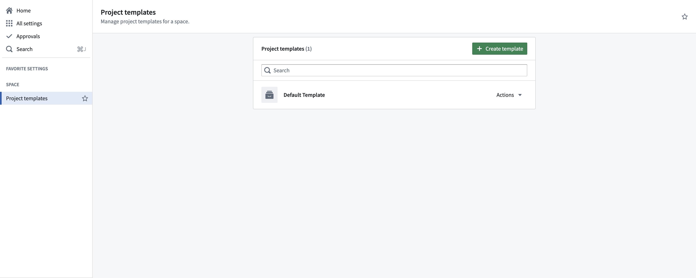
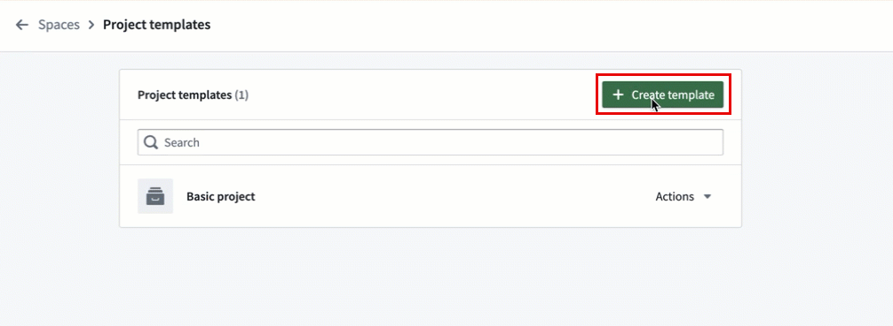
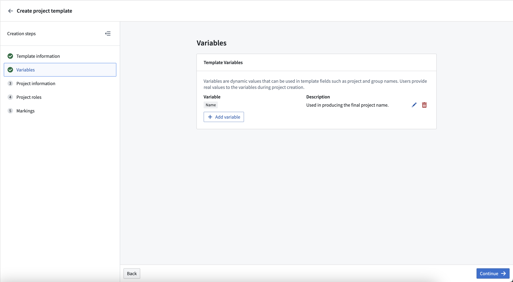
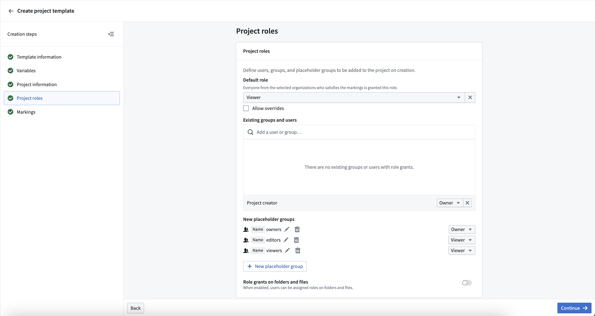
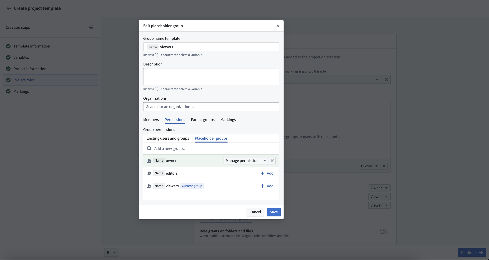
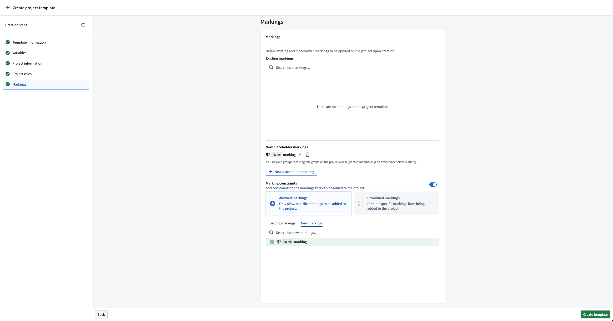

<!-- source: https://palantir.com/docs/foundry/platform-security-management/manage-project-templates/ · mirrored 2026-08-22 from Palantir Foundry docs -->

# Manage Project templates

Project templates standardize the creation and configuration of Projects within a [space](/docs/foundry/security/orgs-and-spaces/#spaces).

Governance frameworks such as the General Data Protection Regulation (GDPR) can be supported through the configuration of platform security primitives like [roles](/docs/foundry/platform-security-management/manage-roles/), [groups](/docs/foundry/platform-security-management/manage-groups/), [Markings](/docs/foundry/platform-security-management/manage-markings/), and [Project constraints](/docs/foundry/platform-security-management/manage-project-constraints/), among others. ​These configurations can be encoded and mandated for all new Projects through Project templates.​ This allows organizations to set governance guardrails on created Projects.

:::callout{theme="neutral"}
Currently, Project templates support the configuration of roles, groups, Markings, and Project constraints. Folder structure and other features will eventually be supported. Development of these features will be incremental.
:::

## Administration

Space owners can create, edit and delete Project templates. Administering Project templates can be done on a per-space level by navigating to **Control Panel > Project templates** and selecting the desired **Space** in the dropdown at the top of the page.

Select **Create template** on the top right of the **Project templates** page to create a new template. This will open the Project template creation wizard, where you can define the template name, description, variables, roles, Markings, and other information.

### Variables

Template creation supports the use of variables to parametrize things like names for groups and Markings. Variables are defined at the time of template deployment (at Project creation) in the **Variables** section of the template creation wizard.

This is especially helpful because Project templates support the configuration of new groups and Markings, which are automatically created at the time of template deployment and Project creation. For example, a variable called `project name` can be used to create groups which follow the convention `project name` + `role`.

### Roles

Setting a **Default role** grants a role on the created project for users who satisfy the Organization and Marking requirements. Additionally, existing users and groups can be configured to have a specified role for all Projects created from this template. If the **Project creator** is given a role, then the user who creates the Project will receive the specified role.

It is common practice to set up viewer, editor, and owner groups, with the owner group having manage permissions on the viewer and editor groups. This can be accomplished in Project templates. Create the desired groups, then give the owner group permissions to the other groups.

### Markings

New or existing Markings can be applied to the Project upon creation. All users or groups who receive a role grant on the project will automatically be granted membership to all new Markings.

[Project constraints](/docs/foundry/security/project-constraints/) can be specified as part of the template. If **Allowed markings** is selected, any new Markings will automatically be allowed. New Markings cannot be specified in **Prohibited markings**.

## Project deployment

All created Projects use a template. The default Project template creates an empty Project with the Project creator as its owner. If a space has more than one Project template configured, then users can select which to use when creating a Project.

Users that have `editor` permissions on a space can create Projects on that space. A Project creator may need the appropriate additional permissions depending on the Project template definition. For example, if a template results in new groups or Markings being created or the application of an existing Marking, the user creating the Project is required to have the corresponding permissions to perform those actions.
