<!-- source: https://palantir.com/docs/foundry/platform-security-management/manage-roles/ · mirrored 2026-08-22 from Palantir Foundry docs -->

# Manage roles

Roles are managed in the Foundry Settings under the Roles section.

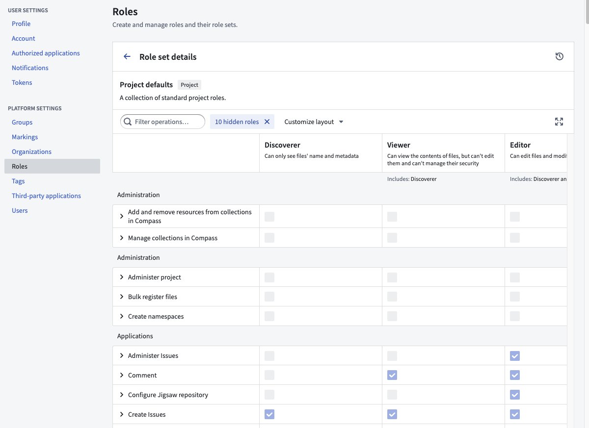

## Customizing the default roles

:::callout{theme="success"}
To customize the roles for your Organization, you must be granted the Organization administrator permission in Control Panel.
:::

### Understanding roles and operations

To understand role customizations, we need to zoom in one level deeper to operations.

Operations are individual permissions that Foundry applications check to verify a user has permission to perform a given action. Roles are sets of operations: when you grant someone a role on a resource (like a Project or a dataset), you are granting them a set of operations on that resource and any child resources underneath it. Each operation has a name and unique identifier.

For example, one of the operations included in the default Owner role (but none of the lesser roles) is named “Change default branch” operation (with identifier: `stemma:mutate-default-branch`) which allows you to change a Code Repository’s default branch. When you grant a user the Owner role on a Project, that user is granted `stemma:mutate-default-branch` on all resources in that Project, so they can change the default branch of any Code Repository inside.

### Creating a custom role

:::callout{theme="success"}
The role management UI can be found under the Roles tab of the platform settings page.
:::

You can create your own entirely new custom role. You might want to create your own custom role to support different types of users in your Organization, such as the [Merger](#merger) or [Supporter](#supporter) roles detailed below.

To create your own custom role, simply click “New Role”, and you will be prompted with the New Role dialog:

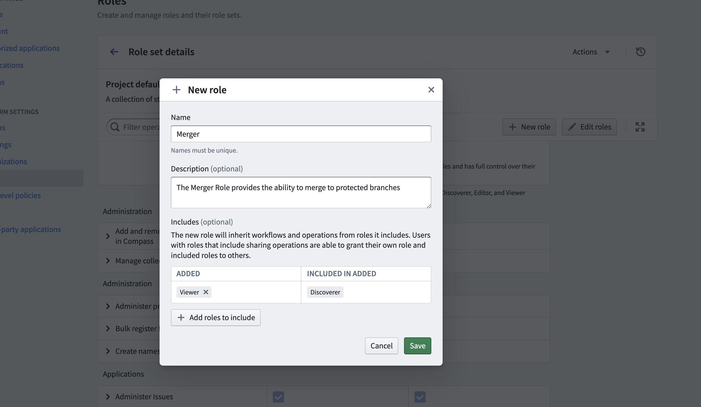

You can “Include” other roles. For the new Merger role above, the Viewer role is included, meaning all permissions granted by Viewer will be granted in the Merger role. Once created, you can customize this role with additional operations.

### Editing the default roles

You can only edit default roles (e.g. Viewer) for a custom [role set](#role-sets). So to customize your Organization's roles, you first need to create a custom role set of the default roles. Then you can edit these default roles.

For example, if you would like all Editors on your instance to be able to change the default branch of repositories, you can simply edit the Editor role to include this operation.

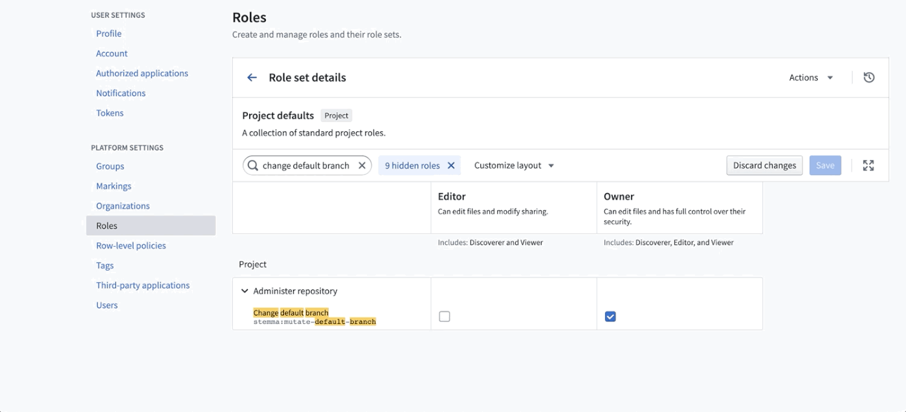

### Sample custom roles

Below are a few examples of custom roles you could create if they are useful for your situation.

#### Merger

The Merger role provides the ability to merge to protected branches, and should be granted in addition to the Viewer role. Create a custom role including the following operations:

* Manage Artifacts repository
* Merge to protected branch
* Merge pull request
* Update pull request

#### Supporter

A supporter is able to see the issues associated with a Project, but is unable to see any metadata (such as schema, name of datasets, and so on). This is primarily for Palantir or third-party support teams, who may not be onboarded or cleared to see certain data. The supporter Role can be created by including the following operations:

* Apply Assignment Rules
* Archive issues
* Edit issues
* Close and reopen issues
* View issues

## Role sets

Role sets are a group of roles that allow the customization of role permissions at the Organization level and are used in a specific context, such as in Projects or the Ontology. Role sets add flexibility when [Organizations](/docs/foundry/security/orgs-and-spaces/#organizations) in the same [enrollment](/docs/foundry/administration/enrollments-and-organizations/) want different roles. Role sets provide the following guarantees:

* Roles in the same set are not dependent on any role outside of that set.
* All roles belong to one and only one role set.
* Roles in the set belong to the same Organization and are permissioned uniformly.
* Roles in the set are designed to work together, in the same context. Currently, the three available contexts for role sets are the Project context, Ontology context, and Marketplace Installation context.

Every enrollment will have at least three default role sets: Project defaults (Owner, Editor, etc.), Ontology defaults (Ontology Owner, Ontology Editor, etc.), and Marketplace Installation defaults (Marketplace Installation Editor, Marketplace Installation Viewer, etc.). Default role sets and the roles within them are always available to all Organizations.

### Create new role sets

Role administrators must have `Manage roles and role sets` permissions on the Organization for which they are managing roles. This permission is granted in Control Panel under the Organization Administrator role. Only an administrator with this permission may create new role sets for the organization and customize existing roles in the role sets that belong to the Organization.

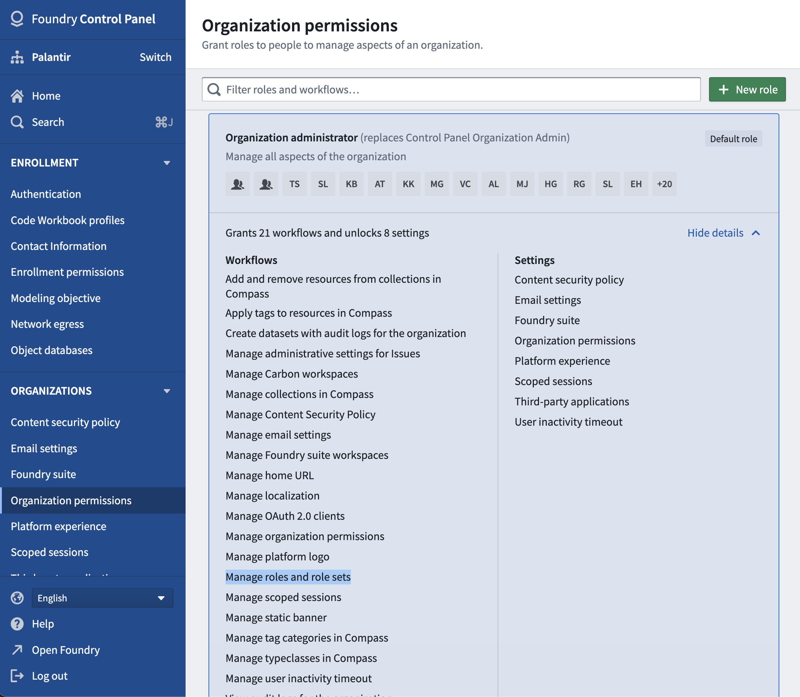

To customize roles for a given Organization, an administrator should first create a new role set.

To do so:

1. Enter **Platform Settings** and click **Create role set** under the Roles section located on the top right.
2. Complete the new role set form.

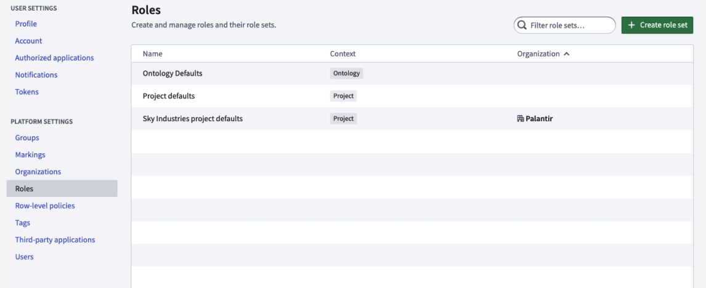

When creating a new role set, the administrator is required to copy roles from an existing role set. The administrator then only has to make relevant changes from an existing role set.

Additionally, when copying the Project default role set or another role set that depends on the Project default role set, the newly copied role set will be automatically updated with any role updates to the Project default role set. As Foundry development continues, new roles may be added by Palantir; receiving these permission updates automatically can reduce future administrative work.

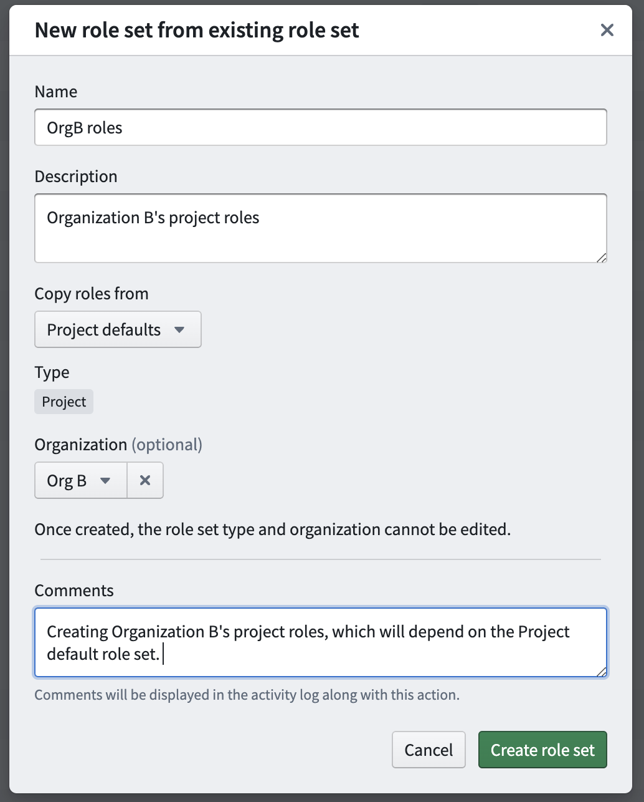

After creation of the role set above, any administrator who has the `Manage roles and role sets` permission on Org B will be able to edit this new role set.

### Share role sets

The visibility of role sets is determined by Organization discoverability. Organization discoverability is managed in the **Organization** section under **Platform Settings**.

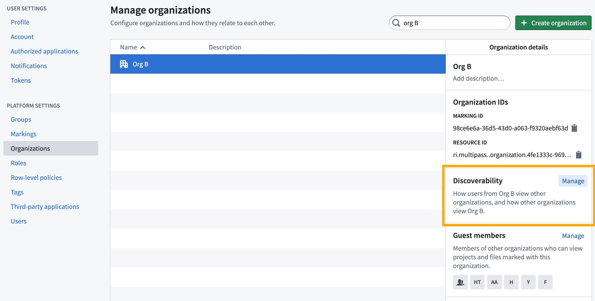

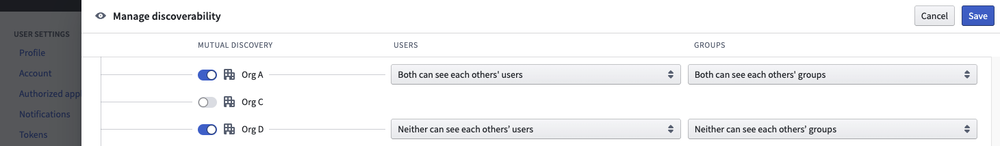

In the above example, Org B’s owned role sets are visible to only Org A and Org D, because they are mutually discoverable (in this case, the first column toggle is selected for all 3 rows). Org B and Org C users cannot see each other's role sets. Allowing users from mutually discoverable Organizations to see each other's role sets facilitates cross-Organization collaboration. For instance, in a Project with both Org A and Org B applied to it, an administrator may want users from both Org A and Org B to receive custom roles defined only by Org B.

### Apply role sets

Role sets can only be applied at the space level. All the Projects, folders, and files within that space can only use the roles defined in the role set applied in the space settings. To manage this, an administrator can:

1. Access the **Space management** page in [Control Panel](/docs/foundry/administration/enrollments-and-organizations/).

2. Pick the role set during the space creation dialog, shown below.

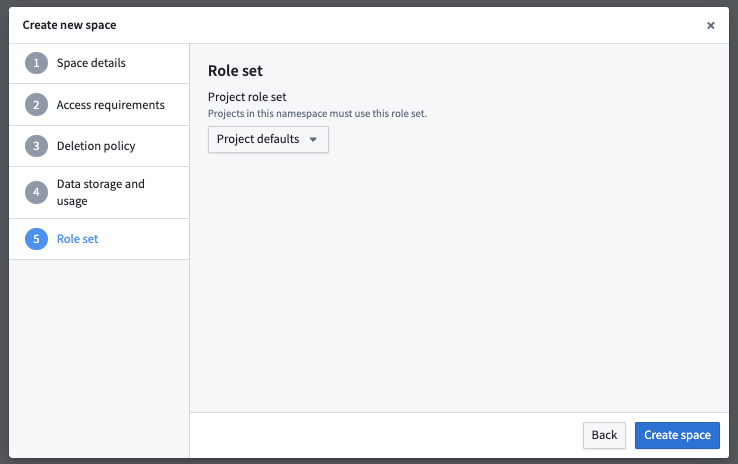

3. An existing role set can also be replaced with a new one in space settings under the **Role sets** card, shown below.

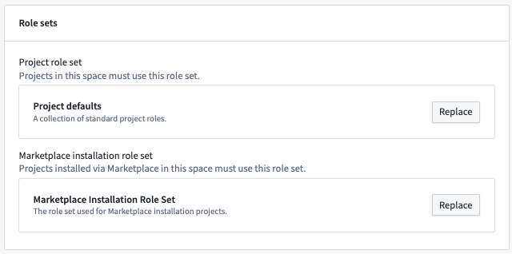

If an administrator replaces the current role set on a space with a new role set, each current role must be mapped to the replacement role. Below is an example of the mapping dialog when updating a role set on an existing space.

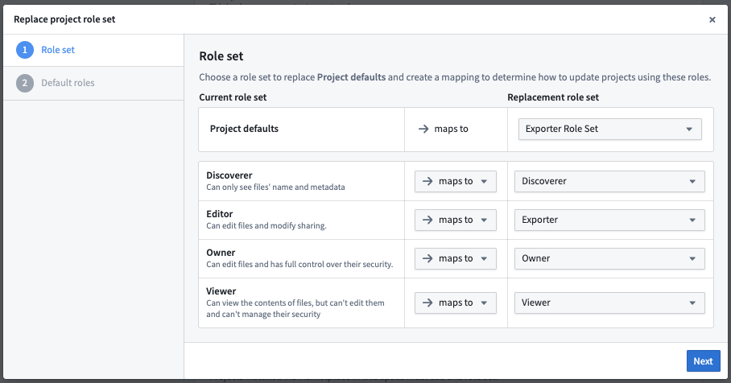

When complete, all role grants throughout the space will be updated to their new replacement role.

When a user moves a resource (Project, folder, or file) across role set boundaries and the resource has a role directly applied to it, the above mapping dialog will also be shown.
