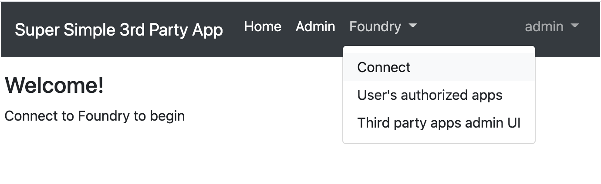
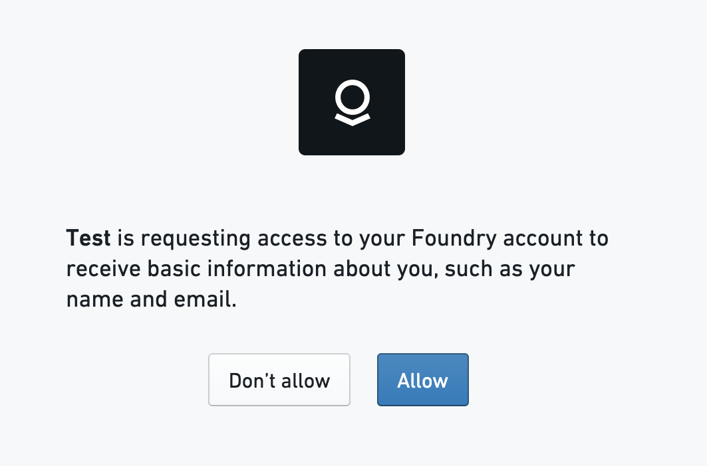
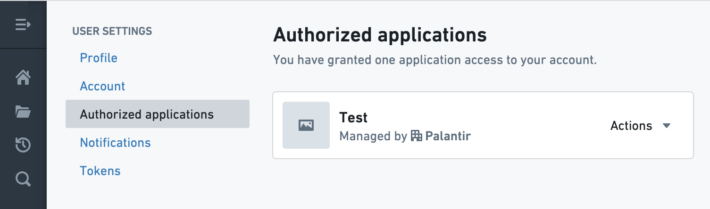
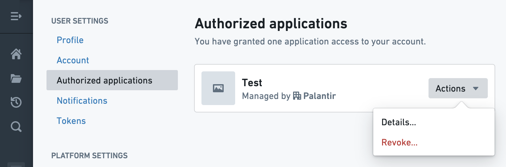
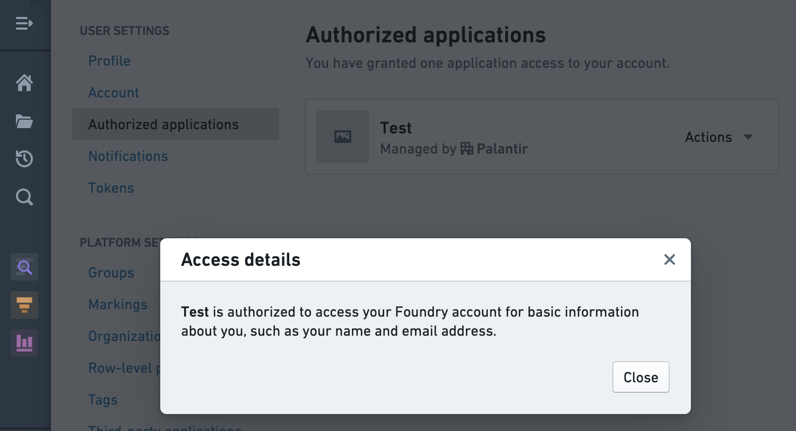
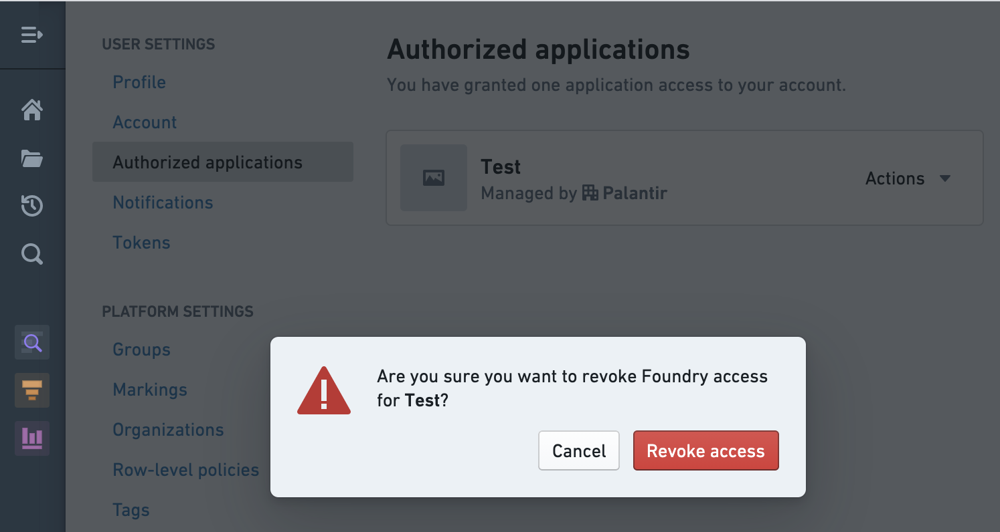
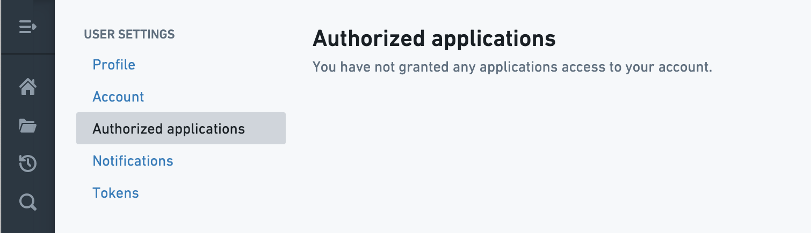

<!-- source: https://palantir.com/docs/foundry/platform-security-third-party/authorizing-3pa-access/ · mirrored 2026-08-16 from Palantir Foundry docs -->

# Authorizing third-party application access

## Authorizing third-party applications

Once a third-party application has been [registered](/docs/foundry/platform-security-third-party/register-3pa/) and [enabled](/docs/foundry/platform-security-third-party/enabling-3pa-access/) in the Foundry platform, the process for authorizing the third-party application to Foundry is simple.

:::callout{theme="neutral"}
If the desired third-party application has not been registered and enabled in the Foundry platform, register and enable it before proceeding with the authorization process or contact your Palantir representative to request registration and/or enablement.
:::

In this example, we’ll use a simple test application to demonstrate the workflow for authorizing a registered and enabled third-party application for Foundry access. Third-party applications may offer some kind of **Connect** option, as seen below.

Attempting to connect or authorize a third-party application that has been registered and enabled will direct you to Foundry and open a confirmation screen, as seen below, in which you can choose to **Allow** or **Don’t allow** access. On this confirmation screen, Foundry will display the set of operations for which the third-party application is requesting permissions; this set of operations is determined by the author of the third-party application connector.

After allowing access, you should be redirected back to the third-party application and receive a confirmation of access permission.

### Managing Authorized Applications

On Foundry’s **Settings** page, the **Authorized Applications** tab displays the third-party applications that have been approved for access. At this point, we can see that the Test application has been granted access to your account.

Clicking on the **Actions** dropdown brings up the following options: **Details** and **Revoke**.

Selecting **Details** displays information about the data that the third-party application can access.

Selecting **Revoke** brings up a confirmation screen; revoking access removes the application’s ability to access information in your account.

After revoking access, we see that no applications have been authorized to access your account. An application whose access has been revoked can be added again by repeating this workflow.

