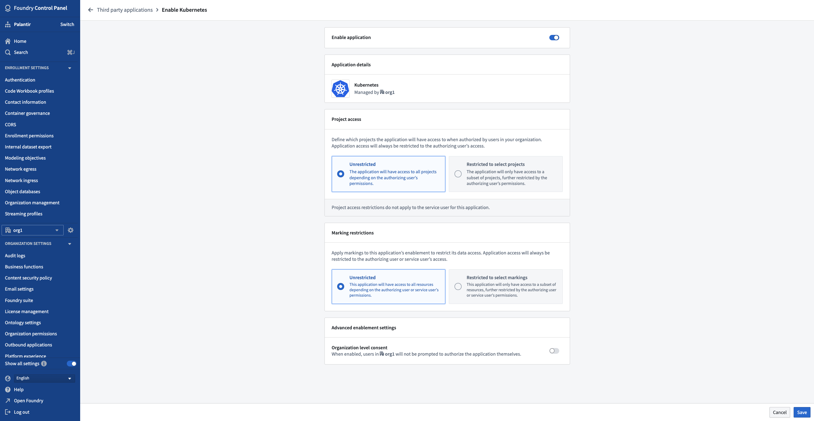

<!-- source: https://palantir.com/docs/foundry/platform-security-third-party/enabling-3pa-access/ · mirrored 2026-08-16 from Palantir Foundry docs -->

# Enabling third-party applications

Foundry’s third-party application enablement framework allows organizations to maintain control of the third-party applications that they have enabled. Organizations can choose which applications to enable since enablements are Organization-specific; the set of enabled applications for an Organization may include applications managed by other Organizations.

Thus, once a third-party application has been registered in Foundry, it needs to be enabled for an Organization before users in the Organization can use the application. This applies to the Organization that registered the third-party application as well as other organizations; applications are not automatically enabled.

After an application has been enabled, users can perform the [OAuth2 authorization flow](/docs/foundry/platform-security-third-party/authorizing-3pa-access/) in order to grant Foundry access to a third-party application. Thus, an application’s access to Foundry resources still requires the user to affirmatively agree to grant access.

## Required permissions

If you have the **Manage OAuth 2.0 clients** permission for your Organization and the third-party application has been made discoverable to that Organization, then you are allowed to enable the application, edit the enablement details of the application, or disable the application.

## Enable or disable applications

The enablement settings interface is accessed by selecting **Enablement settings** from the **Actions** dropdown to the right of an application in the [third-party applications user interface](/docs/foundry/platform-security-third-party/third-party-apps-overview/#accessing-the-third-party-applications-user-interface).

The following is the enablement settings interface for an example application:

Here, you can **enable** or **disable** your application using the toggle at the top of the page.

:::callout{theme="danger" title="Warning"}
Disabling an application is not a simple on and off toggle as re-enabling an application requires the application enablement workflow to be completed again. Existing authorizations for the application will not be reactivated and every user must reauthorize the newly-enabled application.
:::

### Project access

You can also set the scope of Project access for the application. The Project access scope determines the Projects to which the application will have access when authorized on behalf of a Foundry user through the authorization code grant.

* The scope of resources that a third-party application connected to Foundry can access is limited by two factors:
  * The Projects to which the authorizing user has access, and
  * The Projects that are defined on the enablement interface.
* Applications can only access resources at the intersection between the Projects that the authorizing user can access and the Projects that are specified in the enablement interface. In other words, the enablement interface provides a way to narrow the scope of an application’s access to Foundry.
* We recommend leaving the Project scope to **Unrestricted**, which grants the application access to all resources that the authorizing user can access.

### Marking restrictions

Another way of setting the data access scope of your application is through Marking restrictions. By applying [Markings](/docs/foundry/security/markings/) to your application, you can determine the resources the application will have access to when authorized on behalf of a Foundry user through the authorization code grant.

* The scope of resources that a third-party application connected to Foundry can access is limited by two factors:
  * The resources to which the authorizing user has access, and
  * The Markings that are applied through the enablement interface.
* Applications can only access resources at the intersection between what the user can access and those permitted through the Markings specified in the enablement interface. It is important to note that even when access is restricted, unmarked resources may still be utilized unless the user is denied access to them.
* We recommend leaving Marking restrictions as **Unrestricted**, which grants the application access to all resources that the authorizing user can access.

### Organization level consent

In advanced enablement settings, you can authorize access to Foundry for third-party applications on behalf of your Organization's users.

If enabled, users will not be required to perform the [OAuth2 authorization flow](/docs/foundry/platform-security-third-party/authorizing-3pa-access/), and the third-party application will be authorized to access Foundry for all users in that Organization. Users will not be notified if this is enabled.

:::callout{theme="neutral"}
We recommend not enabling Organization level consent unless your use case explicitly requires it.
:::
