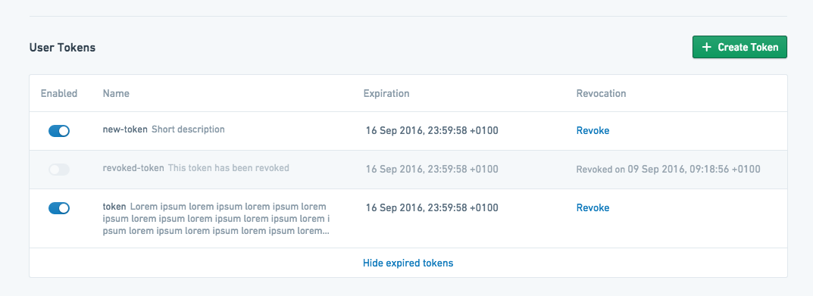
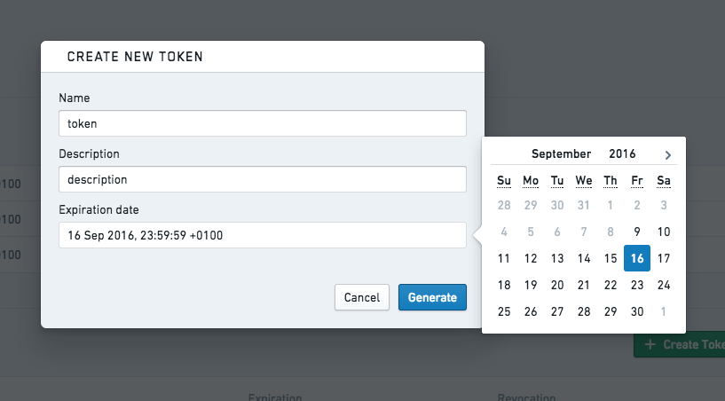
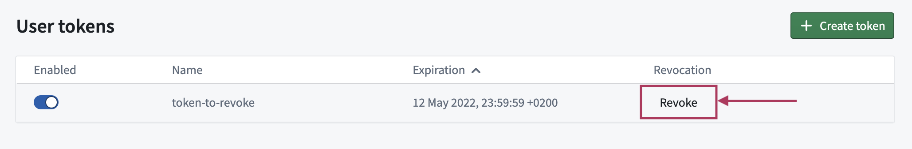

<!-- source: https://palantir.com/docs/foundry/platform-security-third-party/user-generated-tokens/ · mirrored 2026-08-16 from Palantir Foundry docs -->

# User-generated tokens

:::callout{theme="danger" title="Danger"}
These tokens are associated with your personal Foundry user account and **must not be used in production applications or committed to shared or public code repositories**.
We recommend you store test API tokens as environment variables during development.
For authorizing production applications, [register an OAuth2 application](/docs/foundry/platform-security-third-party/third-party-apps-overview/).
:::

Foundry supports token-based authentication. Tokens are strings of characters that serve as secure identification for a specific user. Possession of these tokens is equivalent to possessing a user's username and password, and they should be handled securely and secretly.

## Generation

Tokens are generated from the settings dashboard. Navigate to **Account** at the bottom of the sidebar, click **Settings**, then click **Tokens**.

This interface shows user-generated tokens that have been created for the current user and information on their current state and expiration date. Existing tokens can be disabled from this interface, which temporarily deactivates them, or revoked, which permanently invalidates them. To generate a new token, click **Create Token**. This will open a token creation dialog:

Give the token a useful name, provide a description, and specify the date when the token should expire. After clicking **Generate**, the token will be displayed one time only for security purposes. It can be copied and used as needed, but should not be stored in any insecure manner.

## Revoke

You can revoke individual tokens in the same interface by clicking **Revoke**.

## Inactive users

By default, Foundry user accounts are automatically deactivated after 30 days of a user not logging in. When a user is deactivated, user-generated API tokens and tokens issued to OAuth2 clients become invalid.

The user will otherwise appear fully active, and work scheduled by that user will continue to run. For instance, schedules owned by an inactive user will continue to run.

For a user to be reactivated, they simply need to log in to Foundry again.

Specific users can be exempted from automatic deactivation. For more information on this, contact your Palantir representative.
