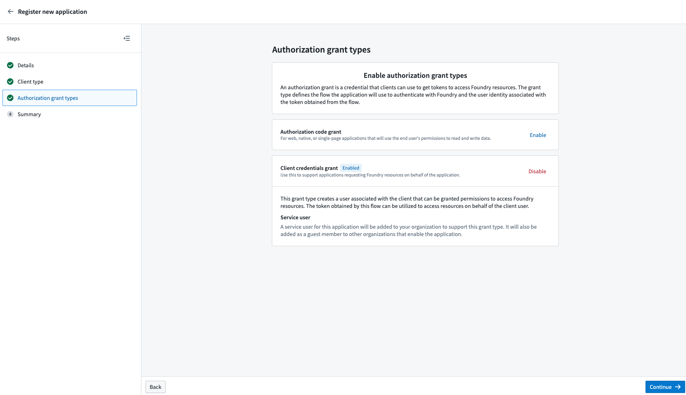

<!-- source: https://palantir.com/docs/foundry/platform-security-third-party/writing-oauth2-clients/ · mirrored 2026-08-16 from Palantir Foundry docs -->

# Writing OAuth2 clients for Foundry

This documentation is intended for Foundry users or administrators who wish to write OAuth2 clients to connect to Foundry. This page provides a description of the [OAuth 2.0 Authorization Framework ↗](https://www.rfc-editor.org/rfc/rfc6749) and details about Foundry’s implementation of OAuth2. Additionally, the [Foundry Third-Party Application & API Agreement](/docs/foundry/platform-security-third-party/3pa-api-guidance/) governs the use of third-party applications on the Foundry platform and should be understood by creators and administrators of third-party applications.

## OAuth2 overview

The OAuth2 authorization framework enables third-party applications to obtain controlled access to a service. OAuth2 improves on the traditional client-server authorization model by providing a layer that enables clients (like a third-party application) to request access through the use of a specifically-issued access tokens and refresh tokens, rather than a user’s credentials or static bearer tokens. OAuth2 manages this access through the use of grants, which are methods of obtaining access tokens.

## Supporting OAuth2 integration

The following sections describe how to support OAuth2 in a third-party application. Throughout the document, **client** refers to the third-party application, **authorization server** refers to Foundry’s authorization server, and **user** refers to the end-user of the third-party application.

To use OAuth2 with Foundry, you must register your application by following the [Registering Third-Party Applications](/docs/foundry/platform-security-third-party/register-3pa/) instructions and choose one of the authorization options in the next sub-sections.

### Authorization code grant

The authorization code grant allows the client to act on behalf of existing Foundry users. The application must request the set of Foundry permissions they need access to, then a Foundry user must explicitly grant the client access to those permissions on their account. Foundry allows the client to be restricted to a limited set of resources, or to all the resources a user can access.

The authorization code grant works as follows:

1. The client creates a `code_verifier` and `code_challenge`. This is **recommended** but not required for *[confidential clients ↗](https://tools.ietf.org/html/rfc6749#section-2.1)*, such as server-based applications, that can safely store a client secret. It is **required** for [*public clients* ↗](https://tools.ietf.org/html/rfc6749#section-2.1), such as native apps, that cannot safely store a client secret.
   * The `code_verifier` is a cryptographically random string that contains A-Z, a-z, 0-9, `-` (hyphen), `.` (period), `_` (underscore), and `~` (tilde), and is 43 to 128 characters long.
   * The `code_challenge` is derived by performing the SHA256 of the `code_verifier` and then converting that to a Base64-URL-encoded value without padding.
2. The client application should open a browser and send the user to the [authorization endpoint](#authorization-endpoint) URL with the following parameters added as query parameters:
   * `response_type`: This should be set to `code`.
   * `client_id`: This should be set to the ID generated when the third-party application was registered in Foundry.
   * `redirect_uri`: This tells the authorization server where to redirect the user after the user approves the request. If not specified, it will default to the first redirect URI value in the Third-Party application setting in Foundry.
   * `scope`: This defines the permissions requested. Scopes for public APIs are in the [API documentation](/docs/foundry/api/general/overview/introduction/). Add the `offline_access` scope to get a refresh token. If you want multiple scopes, concatenate the scopes using a space as a delimiter.
   * `state`: This is a random string generated by the application that will be passed back to the application as is. The application should check that the value returned matches the original string to prevent CSRF attacks.
   * `code_challenge`: If the client created a `code_challenge`, it should populate this parameter. The authorization server will internally associate the `code_challenge` parameter with the authorization code it generates.
   * `code_challenge_method`: This should be set to `S256`.
3. When the user visits the URL, the authorization server presents the user with a prompt similar to the following and the user then can choose to approves the app’s request.

4. If the request is successful, the authorization server then redirects the user to the redirect URI that was specified along with the following parameters added as query parameters:
   * `code`: This is the authorization code that the authorization server generates.
   * `state`: This is the same parameter the client passed in the authorization request. The client should check that it matches the original `state` parameter that was sent in the request.
5. The client should then exchange the authorization code for an access token by calling the [token endpoint](#token-endpoint). The following parameters should be sent using the `application/x-www-form-urlencoded` format in the request body:
   * `grant_type`: This should be set to `authorization_code`.
   * `code`: The code that was received from the authorization server.
   * `redirect_uri`: The absolute URI that the user agent will be redirected to.
   * `client_id`: This should be set to the ID generated when the third-party application was registered in Foundry.
   * `code_verifier`: If the client generated a `code_verifier`, it should send it in this request. The authorization server will verify that the `code_verifier` matches the `code_challenge` that was sent in the previous request.
6. The authorization server then responds with an access token which can then be used by the client to access the requested resources such as REST APIs. The response contains the following parameters:
   * `access_token`: The token that can be used by the client to access the requested resources.
   * `token_type`: The type of the token that was issued.
   * `expires_in`: The lifetime in seconds of the access token.
   * `refresh_token`: This is returned only if the requested scope included `offline_access`. This should be used if the client wants to refresh the access token without the user being present to authorize the request. For more information, see [Refreshing an access token](#refreshing-an-access-token).

### Client credentials grant

The client credentials grant is designed for non-interactive service-user style workflows where actions the client makes are not associated to normal Foundry users. The client does not act on behalf of normal Foundry users.

Instead, this grant type automatically creates a Foundry service user associated with the client that can then be granted permissions to access Foundry resources. The token obtained by this grant can be used to access resources on behalf of the created service user. The username of the service user account is the same as the client ID of the application.

:::callout{theme="neutral"}
By default, the service account does not have access to any resources. A Foundry administrator must assign the desired roles and permissions to the service user account for the client to perform actions in Foundry.
:::

The client credentials grant works as follows:

1. The client calls the [token endpoint](#token-endpoint). The following parameters should be sent using the `application/x-www-form-urlencoded` format in the request body:
   * `grant_type`: This should be set to `client_credentials`.
   * `client_id`: This should be set to the ID generated when the third-party application was registered in Foundry.
   * `client_secret`: This should be set to the client secret that was generated when the third-party application was registered in Foundry.
2. The authorization server then responds back with the following:
   * `access_token`: The token that can be used by the client to access the requested resources.
   * `token_type`: The type of the token that was issued.
   * `expires_in`: The lifetime in seconds of the access token.
3. The client can then use the access token to access the requested resources.

### Refreshing an access token

Access tokens expire after some time and will need to be obtained again. Any client that needs access to the Foundry API when the user is not present will need to refresh the token.

This can be done by following these steps:

1. The client should follow the steps outlined in [Authorization Code Grant](#authorization-code-grant) and specify `offline_access` as part of the requested `scope` parameter.
2. The client should save the returned `refresh_token` that was returned in the final step of [Authorization Code Grant](#authorization-code-grant).
3. If the access token expires, the client can then refresh the token by calling the [token endpoint](#token-endpoint) endpoint using the following parameters:
   * `grant_type`: This should be set to `refresh_token`.
   * `refresh_token`: The access token that was obtained previously for the given user.
   * `client_id`: This should be set to the ID generated when the third-party application was registered in Foundry.
   * `client_secret`: This should be set to the client secret that was generated when the third-party application was registered in Foundry.
4. The authorization server will then respond with the following:
   * `access_token` The token that can be used by the client to access the requested resources.
   * `token_type`: The type of the token that was issued.
   * `expires_in`: The lifetime in seconds of the access token.
   * `refresh_token`: The refresh token that can be used to refresh the access token. Note that Foundry rotates the refresh token each time the previously issued refresh token is used. Make sure you save both the `access_token` and the `refresh_token`.

#### Refresh token rotation

Refresh tokens can be used to obtain new access tokens. Foundry reduces the risk associated with refresh tokens by rotating the refresh tokens each time the previously issued refresh token is used.
A reuse detection protection mechanism ensures that if a refresh token is reused after one minute of its initial use, all access tokens created from this grant are invalidated and a new authorization flow is required.
A one minute interval of reuse is allowed to account for possible transient errors like network failures. Additionally, inactive refresh tokens over 30 days old are automatically invalidated. These safeguards reduce risk from potentially compromised tokens by ensuring there are no long-lived refresh tokens.

## OAuth2 API reference

The following endpoints can be used to obtain OAuth2 tokens.

### Authorization endpoint

`GET /multipass/api/oauth2/authorize`

The authorization endpoint, used by the client to obtain an authorization code.

#### Query parameters

| Parameter name | Type | Description |
|---|---|---|
| response\_type         | String	        | This must be set to `code`. |
| client\_id             | String	        | The unique identifier of the client. |
| redirect\_uri          | String	        | The absolute URI that the user agent will be redirected to. This must match one of the Redirect URIs that was specified in the Control Panel. You can access this URI again by navigating to the [Manage Application](/docs/foundry/platform-security-third-party/manage-3pa/) screen. |
| scope                 | String	        | The scope of the permissions to be requested. Scopes for public APIs are in the [API documentation](/docs/foundry/api/general/overview/introduction/) and should be listed as a space-separated string. |
| state                 | String (optional)	| An arbitrary string passed to the server that gets passed back to the client as is. This helps prevent cross-site request forgery. |
| code\_challenge        | String (optional)	| The code challenge generated by the client; used with [Authorization Code Grant with Proof Key for Code Exchange (PKCE)](#authorization-code-grant) |
| code\_challenge\_method | String (optional)	| This should be set `S256` if `code_challenge` is used. |

#### Redirect query parameters

If the request is successful, the user’s browser is redirected to the redirect URI specified in the Third-Party application settings or in the redirect URI passed in the request. The following query parameters will be present in the redirect request URI:

| Parameter name | Type               | Description	|
|----------------|--------------------|-------------|
| code           | String	          | The authorization code that was generated. This code will expire after 10 minutes. |
| state          | String (optional)  | If the `state` parameter was present in the authorization request, this will contain that exact value. |

### Token endpoint

`POST /multipass/api/oauth2/token`

The token endpoint is used by the client to obtain an access token by presenting its authorization grant or refresh token.

#### Header parameters

| Parameter name | Description |
|----------------|---|
| Content-Type | Must be `application/x-www-form-urlencoded`. |

#### Request body parameters

| Parameter name | Type | Description |
|----------------|------|-------------|
| grant\_type     | String | Value must be `authorization_code`, `refresh_token`, or `client_credentials` |
| code           | String (optional) | The authorization code received from the authorization endpoint. This is required if the grant type is `authorization_code` |
| refresh\_token  | String (optional) | This is required when `grant_type` is `refresh_token`. The value should be the `refresh_token` that was obtained in the original request when the authorization code was obtained. |
| redirect\_uri   | String (optional/required) | The absolute URI that the user agent will be redirected to. This is **required** if a redirect URI was specified in the Authorization Request. |
| scope          | String (optional) | The scope of the permissions to be requested. Scopes for public APIs are in the [API documentation](/docs/foundry/api/general/overview/introduction/) and should be listed as a space-separated string. |
| client\_id      | String            | The unique identifier of the client. |
| client\_secret  | String (optional) | The application's client secret that was issued during application registration. This is required when `grant_type` is `client_credentials`. |
| code\_verifier  | String (optional) | The code verifier used for the PKCE request that the application generated before the authorization request. |

#### Response body

The response JSON has the following fields.

| Field name    | type              | Description |
|---------------|-------------------|-------------|
| access\_token  | String            | The credentials used to access resources. |
| token\_type    | String            | The type of the token issued. |
| expires\_in    | String            | The lifetime in seconds of the access token. |
| refresh\_token | String (optional) | The credentials used to obtain new access tokens. Foundry rotates `refresh_token` every time a `refresh_token` grant is called. Make sure you save both the `access_token` and the `refresh_token`. |

### Endpoint errors

#### Error response body

If the request fails, the user’s browser will only be redirected if the access request is denied. In all other cases, an HTML error page is returned which includes the fields below.

| Field name        | Type   | Description                                    |
|-------------------|---------|-------------------------------------------------|
| error             | String | The error code as defined in the next section. |
| error\_description | String | The human-readable description of the error    |

#### Error codes

| Error code value            | Description                                                    |
|-----------------------------|----------------------------------------------------------------|
| `invalid_request`           | The request was invalid.                                       |
| `unauthorized_client`       | The client is not authorized to request an authorization code. |
| `access_denied`             | The sever denied the request.                                  |
| `unsupported_response_type` | The provided response type is not supported.                   |
| `invalid_scope`             | The requested scope is invalid, unknown, or malformed          |
| `server_error`              | There was an unexpected server error.                          |
