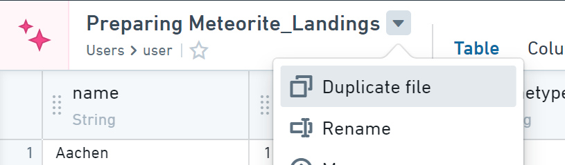
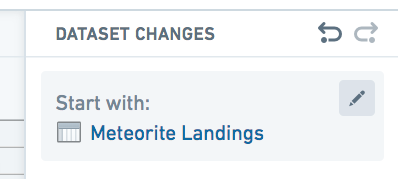
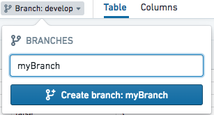
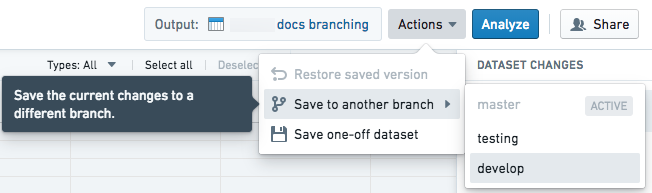
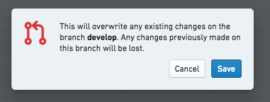
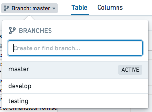
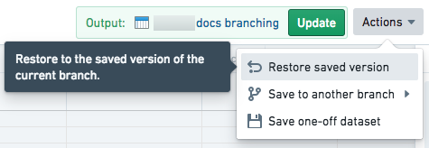

<!-- source: https://palantir.com/docs/foundry/preparation/advanced-examples/ · mirrored 2026-08-26 from Palantir Foundry docs -->

# Advanced examples

This page explores examples of advanced transforms and workflows to clean and prepare your data in the Preparations interface.

## Write an expression

Preparation's **Apply expression** feature allows you to use Contour's rich expression language to write advanced transformations on data columns. Learn more about the [expressions syntax and function reference](/docs/foundry/contour/expressions-syntax/).

## Reuse a preparation on a different dataset

1. Duplicate the preparation by choosing **Duplicate file** from the action menu indicated by the downward arrow beside the preparation file name.

    

2. To change the starting dataset, first scroll to the starting dataset at the bottom of the changelog.

3. Next, click the settings menu and choose **Change**.

4. Finally, select the desired starting dataset.

    

:::callout{theme="warning"}
Some differences in the schema or data of the updated dataset (for example, different column names or types) might be incompatible with changes made in the preparation. If so, you will see an error message and changes highlighted in red. Remove indicated changes as necessary.
:::

## Use multiple output dataset branches

It is possible for a preparation to use multiple output dataset branches. Instructions for doing so are found below.

### Create a new branch

1. Click the branch selector dropdown in the header underneath the preparation name.
2. Enter the new branch name in the popover and click the **Create branch** button.

   

### Save to a different branch

1. Click the **Actions** menu button, then select **Save to another branch**. In the update dataset dropdown, select the branch to which you wish to save.

    

2. Confirm the prompt and click **Save**.

    

### Switch the current branch

Click the branch selector dropdown in the header underneath the preparation name. Type in the input field to filter the list of available branches.

### Restore a saved version

1. Switch to the branch of the saved version you wish to restore.
2. Click the **Actions** dropdown button and click the **Restore saved version** option.

