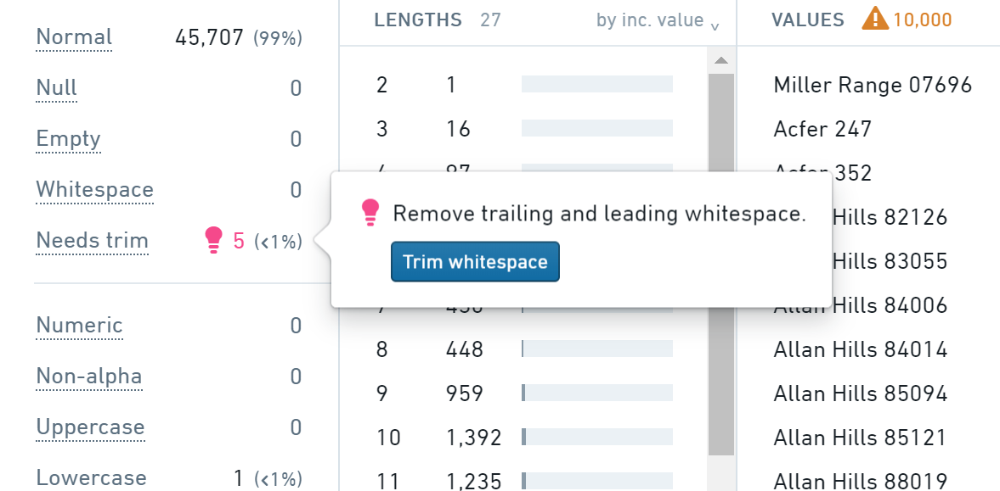
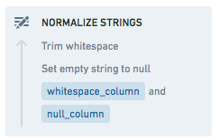
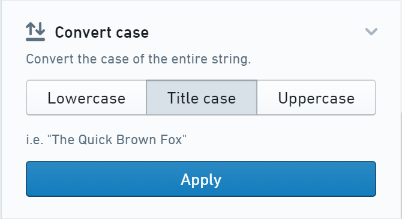
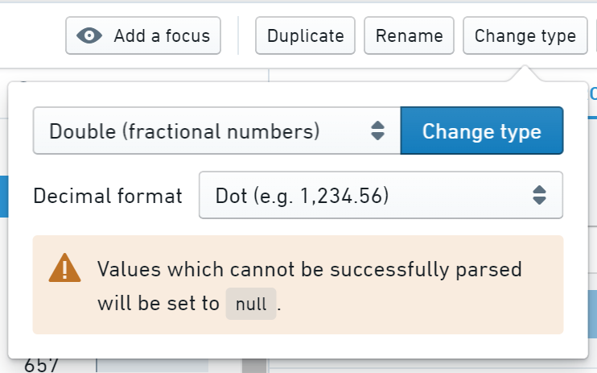
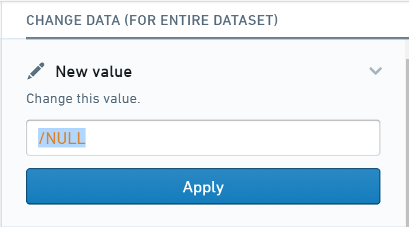

<!-- source: https://palantir.com/docs/foundry/preparation/basic-examples/ · mirrored 2026-08-26 from Palantir Foundry docs -->

# Basic examples

This page explores examples of basic transforms to clean and prepare your data in the Preparations interface.

## Remove leading and trailing whitespace

If some values have leading/trailing whitespace, they will be counted under **Needs trim** in the stats area.

Click the pink lightbulb next to **Needs trim**, then **Trim whitespace** to remove the leading and trailing whitespace from the values in that column.



## Set empty strings to `null`

If some values are empty strings, they will be counted under **Empty** in the stats area.

Click the pink lightbulb next to **Empty**, then **Set to null** to set any empty string values in that column to `null`.

## Normalize multiple string columns at once

1. Select the string columns you wish to normalize (or default to all string columns with no selected columns).
2. Choose the **Normalize strings** action and select the actions you wish to apply.

   

## Normalize values to uppercase

The stats panel on the left will show how many values in the column are uppercase, lowercase or mixed case.

To normalize the values to uppercase, choose the **Change Case** action and click **Uppercase** (you can also use **Lowercase** or **Title case** as appropriate).



## Parse currency strings into a numeric column

If numeric values have extraneous non-numeric characters (for example, `$1,234.56`) the column type will usually be detected as `string`. However, the column should be numeric to analyze it numerically.

Check the stats area to ensure the values are showing as **Numeric**.

:::callout{theme="neutral"}
If some values are showing as non-alpha, uppercase, etc., you must first clean them to allow them to be parsed as numbers. Click the relevant category (e.g. `non-alpha`) to explore those values and begin cleaning.
:::

Click the **Change type** button, choose either Integer (for whole
numbers) or Double (for numbers with decimals) from the dropdown.



## Nullify values that imply no data, e.g. N/A

Often, columns will end up with values that imply that there is no data available (e.g. N/A, Other, None, Unknown, etc). Typically, those values should be `null` to properly indicate that no data is available in that cell.

1. Select the value or values in the histogram.
   * If you do not see the values, try searching for them using the **Filter...** box.
2. Click the **New value** action, enter `/NULL`, and click **Apply**.

    

:::callout{theme="neutral"}
Make sure you select one or more values before applying the change, or the entire column will be set to `null`.
:::

## Normalize ZIP codes to five digits

ZIP code columns can sometimes be a mix of five-digit (`12345`) and nine-digit (`12345-6789`) values. Typically, ZIP codes should be normalized to a single format to allow for grouping and other preparation workflows.

Normalize ZIP code columns to five digits using the **Extract** action. Click the **Extract** action, choose **Indexed Substring** from the **Type** dropdown, then use a start index of `1` and an end index of `5`.

## Rename all columns to snake case

Snake case (`lowercase_with_underscores`) is a common column naming standard across many deployments.

Click the **Normalize column names** action. If the action is not visible, make sure no columns are selected. Choose **Standard**, and click **Apply**.

All columns will be instantly renamed to snake case, meaning the column values with have a format of lowercase letters with underscores instead of special characters.

## Rename many columns

The **Columns** view is the easiest way to rename many columns. Switch to **Columns** view by clicking **Columns** at the top of the screen.

:::callout{theme="neutral"}
Bulk column changes are not saved until you click **Apply**.
:::

For any column that needs renaming, click into the column name and edit as necessary. The column name will turn green to indicate that the change is staged but not yet applied.

Once all the column names are fixed, click the **Apply** button at the top of the [changelog](/docs/foundry/preparation/overview/#terminology) on the right to save all the column name changes.

## Delete null columns

Sometimes, columns only contain `null` values. You can clean up the dataset by removing the column entirely.

Check the stats panel to verify that the column contains entirely null values; the stats should say `100%` for **Null**.

Then, click the **Delete column** button to remove the column.

## Remove rows with a null value

Sometimes, rows with a `null` value in a particular column are irrelevant and can be removed.

Select the column, and check the **Null** section of the stats panel to see how many rows have a `null` value for that column.

Next, click on **Null** in the stats panel, then the **Focus in** button, to focus only on the rows with `null` values. Check to be sure that these rows are irrelevant and can be deleted.

To remove these rows, click the **Remove rows** button at the top of the screen.

## Capture the row order of the original data

From the initial view, use the **Add new column** action with the
following expression:

```sql
monotonically_increasing_id()
```

This will add a column of numbers that are guaranteed to be increasing based
on the row order, but may be neither consecutive nor deterministic.

:::callout{theme="neutral"}
The column values can change for each computation. This can lead to unexpected behavior, such as a dataset saved from the preparation having different numbers associated with the rows when built multiple times, or the histogram of the row number column not being consistent with the table data.
:::

## Add row numbers (for small datasets only)

From the initial view, use the **Add new column** action with the
following expression:

```sql
row_number() over (order by monotonically_increasing_id())
```

:::callout{theme="warning"}
This row number expression can be very expensive to compute, and it may significantly hinder the performance of the preparation when working with large datasets.
:::

## Insert changes into the middle of the changelog

From the initial view, choose the change above which you would like to insert changes. Then, enter preview mode by clicking on the change or selecting **Preview data** in the change dropdown menu.

Make changes to the preparation. The changes will appear above the change being previewed but below future changes.

Exit preview mode by clicking **Cancel** in the preview warning bar.
