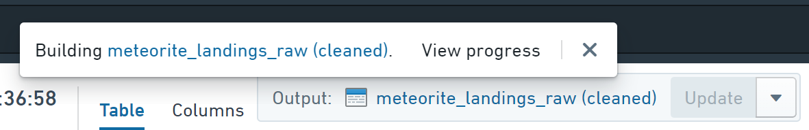

<!-- source: https://palantir.com/docs/foundry/preparation/getting-started/ · mirrored 2026-08-26 from Palantir Foundry docs -->

# Getting started

:::callout{theme="warning"}
Preparation has been superseded by [Pipeline Builder](/docs/foundry/pipeline-builder/overview/) and is therefore no longer the recommended approach for cleaning and preparing data. Pipeline Builder makes it easy to clean and prepare your data for pipelines, while also offering [Marketplace](/docs/foundry/marketplace/overview/) support.
:::

This page will help introduce you to the Preparation interface for cleaning and preparing datasets.

## Open a dataset for cleaning and preparation

### From a dataset

Choose **Clean in Preparation** from the **Actions** menu on any dataset to create a new [preparation](/docs/foundry/preparation/overview/#terminology) for that dataset.

### From the Preparation screen

Click the **Select a dataset...** button, and select the dataset to clean/prepare.

## Clean and prepare your data

1. Click on a column to see an overview of the data in that column, and apply cleaning and preparation actions.
   * There are two preparation views: **Table** (which looks like a spreadsheet) and **Column** (which shows a more compact card for each column).
2. View the [basic examples](/docs/foundry/preparation/basic-examples/) page for various ways to clean and prepare data.

### Analyze in Contour while cleaning/preparing

1. Click the **Analyze** button to open the current preparation in Contour.
2. As you make changes to the preparation, Contour will prompt to update. Click the **Update data** button in Contour to refresh the analysis based on the preparation.

## Save a cleaned or prepared copy of a dataset

1. Click the **Save as dataset** button in the header bar.
   * By default, this action will create an updating dataset that can be rebuilt based on changes to the underlying data set or changes to the preparation. To save off a one-off dataset, click the arrow beside the **Save as dataset** button and choose **Save one-off dataset**.
2. Select where you want the dataset to be saved, then click **Save**. The dataset will begin building, and you will be notified when it is ready.

   
