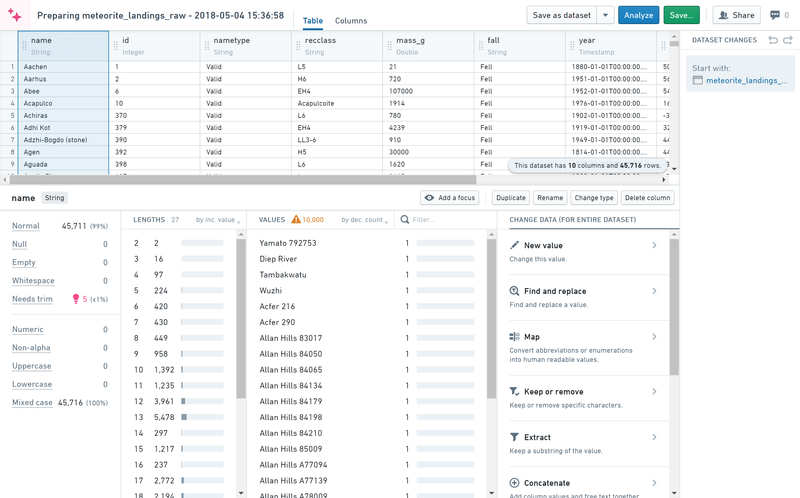

<!-- source: https://palantir.com/docs/foundry/preparation/overview/ · mirrored 2026-08-26 from Palantir Foundry docs -->

# Preparation \[Sunset]

:::callout{theme="warning" title="Sunset"}
Preparation is in the [sunset](/docs/foundry/platform-overview/development-life-cycle/) phase of development and will be deprecated at a future date. Full support remains available. We recommend migrating your workflows to Pipeline Builder for cleaning and preparing data and to take advantage of [Marketplace](/docs/foundry/marketplace/overview/) support.
:::

Preparation is an interactive tool for cleaning and preparing data. Cleaning refers to fixing data quality issues, and preparing refers to manipulating data to make it usable for a specific analytic task.

The dataset shown below comes from The Meteoritical Society via the [NASA Data Portal ↗](https://catalog.data.gov/dataset/meteorite-landings).

## Terminology

The following terms are useful to know before using the Preparation tool:

* **Preparation:** A cleaning/preparation session

* **Clean:** Fix data quality issues in a dataset

* **Prepare:** Adapt a dataset for a specific use

* **Change:** An individual clean/prepare step

* **Changelog:** All the changes made within a preparation
