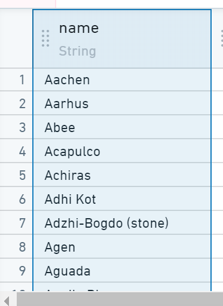
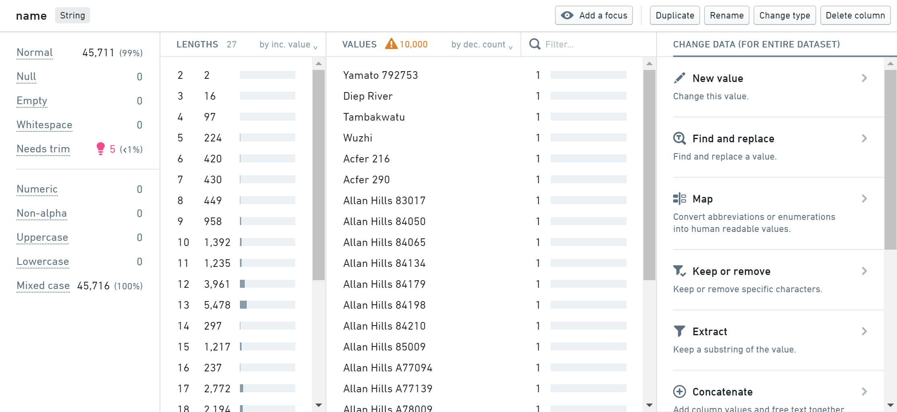
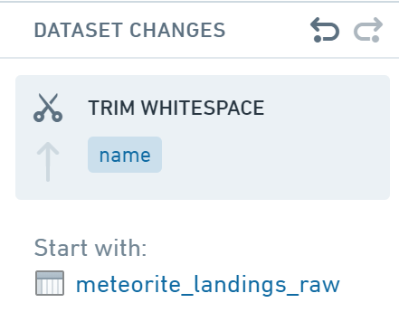
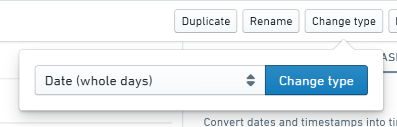
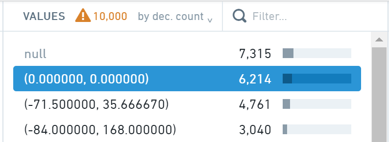

<!-- source: https://palantir.com/docs/foundry/preparation/preparation-tutorial/ · mirrored 2026-08-26 from Palantir Foundry docs -->

# Create a simple preparation

:::callout{theme="warning"}
Preparation has been superseded by [Pipeline Builder](/docs/foundry/pipeline-builder/overview/) and is therefore no longer the recommended approach for cleaning and preparing data. Pipeline Builder makes it easy to clean and prepare your data for pipelines, while also offering [Marketplace](/docs/foundry/marketplace/overview/) support.
:::

The following tutorial will walk you through how to use Preparation to transform a spreadsheet of raw data to a cleaned and prepared dataset ready for analysis.

This tutorial uses data from The Meteoritical Society via the [NASA Data Portal ↗](https://catalog.data.gov/dataset/meteorite-landings). You can follow along on your own Preparation instance with this sample dataset:

[Download meteorite\_landings\_raw](/docs/resources/foundry/preparation/meteorite_landings_raw.csv)

This dataset contains raw data about meteorites that have been found on Earth.

The dataset includes name, mass, classification, and other identifying information for each meteorite, along with the year it was discovered and coordinates of where it was found.

We recommend opening the CSV to review the data before [uploading into Foundry](/docs/foundry/compass/manually-upload-data/).

## 1. Create a preparation

We will get started by creating a new preparation.

1. First, upload the `meteorite_landings_raw.csv` file into Foundry.

2. Then, navigate to the `meteorite_landings_raw` dataset, right-click, and choose **Clean in Preparation**.

This creates a new [preparation](/docs/foundry/preparation/overview/). You should save your preparation with a meaningful name to make it easier to find again in your files.

3. Finally, click **Save** and choose a name and save location for the preparation.

:::callout{theme="neutral"}
Preparations that you create and do not explicitly save are stored by
default in **Files > .auto-save**.
:::

## 2. Clean data

Now, review the dataset and identify and fix any data quality issues you find.

### Trim whitespace

1. First, click on the **name** column in the table:

The panels below will show some information about the data in the
column: statistics, charts, etc:

You can see from the statistics panel that some of the values have been flagged as **Needs trim**, which means that there is extraneous
whitespace at the beginning or end of the value.

2. Hover over the pink lightbulb, and click the **Trim whitespace** button to fix this issue.

After the column statistics refresh, you should now see that the **Needs trim** count is now zero, and the column has been cleaned successfully. You will also see the **Trim whitespace** change added to the **Dataset Changes** list on the right side of the screen:

### Transform `year` column to a date

Now, move on to the **year** column. You can see in the table that the data type of the column is **Timestamp**. However, we want it to just be a **Date**.

1. First, click the **Change type** button and choose **Date (whole days)** from the dropdown list.

2. Click the **Change type** button.

### Set geolocation values to `null`

Finally, look at the **GeoLocation** column. You will see in the histogram that a large number of rows have a value of **(0.000000,0.000000)**, which is not a valid geolocation.

Fix these values by setting them to `null`.

1. First, select the **(0.000000, 0.000000)** value in the histogram.
2. Next, click the **New value** action under **Change data (for selected rows)**.
3. Finally, enter `/NULL` in the text box, and click **Apply** to set these values to `null`.

## 3. Save a cleaned version of a dataset

Now that we have cleaned up data quality issues, we can save a new,
cleaned version of this dataset.

1. First, click the **Save as dataset** button at the top of the screen.
2. Then, choose a name and location for the new cleaned dataset. A pop-up will appear indicating that the new dataset is being built.

There will be a link to the new dataset indicated by **Output:**. As you make changes to the preparation, you can update the output dataset using the **Update** button.

:::callout
To try out the results of your cleaning in Contour without having to save a new dataset, click the **Analyze** button at the top of the screen.
:::
