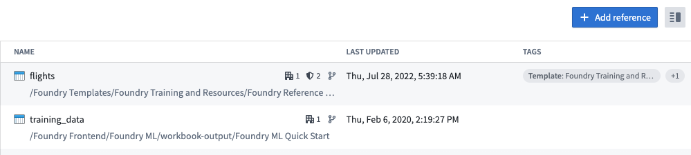
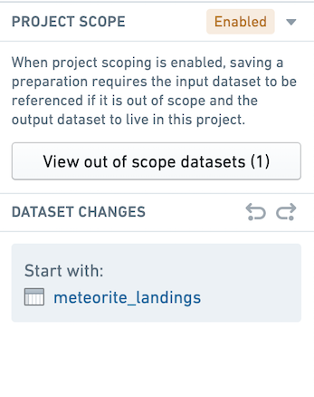
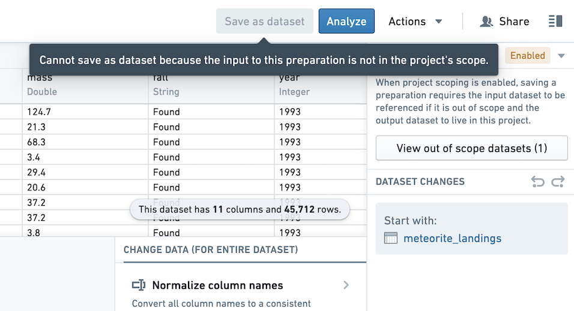

<!-- source: https://palantir.com/docs/foundry/preparation/project-references/ · mirrored 2026-08-26 from Palantir Foundry docs -->

# Project references

In Foundry, [Projects](/docs/foundry/compass/move-and-share-resources/) define both a conceptual boundary around related work and a security boundary for applying and managing access. Using data across project boundaries must be treated with extra care.

## Project references

Project references provide a mechanism for users with higher permissions (typically the owners of a dataset or pipeline) to allow the discovery and use of data in pipelines in other Projects. Project references add an increased layer of scrutiny for persistently moving data between Projects by explicitly acknowledging when a dataset is imported into a Project.

To add a resource reference to a Project, go to the [Project details panel](/docs/foundry/compass/use-project-details-panel/) at the root level of the Project. Click the **+Add reference** button to add a reference to a dataset. In the below image, the datasets `flights` and `training_data` are added as references in the Project. This means that you can use `flights` and `training_data` as inputs to a saved dataset in a preparation.

:::callout{theme="neutral"}
To reference a resource, you must have `compass:import-resource-from` on the resource (usually expanded from the `Viewer role`), and `compass:import-resource-to` on the destination Project (usually expanded from the `Editor` role). These roles can be customized using [custom roles](/docs/foundry/administration/enrollments-and-organizations-permissions/#custom-roles) in Control Panel.
:::

## Project-scoped preparations

:::callout{theme="neutral"}
As of Contour 9.161.0, all new preparations have Project scoping enabled.
:::

To save an output dataset in a Project-scoped preparation, the input and output dataset must be in the Project scope.

The input dataset to the preparation must be in the Project scope. This means that the input dataset must be in the same Project as the workbook or added as a reference in the Project.

The output dataset must be in the same Project as the preparation.

View the Project scope settings for a preparation in the top right corner of the Preparation interface. Any input or output datasets that are out of scope will be listed in the Project scoping dialog. You may choose to add a reference directly from the dialog.

When the input dataset is out of scope, you not be able to save an output dataset.

:::callout{theme="neutral"}
You do not need to add a reference to use Preparation on an input dataset if you are not saving a cleaned dataset.
:::

## Enable Project scoping on your preparation

If you created a preparation before Project scoping was enabled by default, you can enable Project scoping in the top right of your preparation. Before enabling Project scoping, you must address any out of scope inputs by adding a reference to inputs and any out of scope outputs by moving the output to the preparation's Project.
