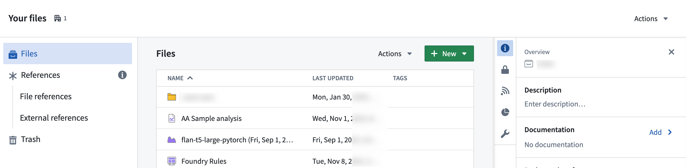

<!-- source: https://palantir.com/docs/foundry/projects/manually-upload-data/ · mirrored 2026-08-22 from Palantir Foundry docs -->

# Manually upload data

You can manually upload data from your own sources to use in your Projects. All data should be approved for the purpose of your use case (no personal data, for example) or notional data.

Start by opening the file on your computer to verify its contents. Check the number of header rows and if any of the columns have numeric or date/time data. This information will be useful later.

In the platform, navigate to the desired folder via **Files** in the workspace navigation sidebar, and then select **Your files**.

Within your home folder, you can create a folder named `data` to keep your files organized. Select the folder to navigate to it. You should now be in `Your files > data` or `/<shared-folder-path> > data`.

Next, either directly drag and drop files onto your browser for upload into your folder, or alternatively, select **+ New > Upload files...** to start the upload process.

During the upload process, choose how you would like to upload the file(s):

* **Upload as media set (recommended):** Upload selected files [to a new media set.](/docs/foundry/data-integration/media-sets/)
* **Upload to a dataset without a schema:** To store a collection of arbitrary files.
* **Upload as a raw file without modifying the extension**

Then, configure your upload, and choose the **Write mode**.

Write modes include:

* Transactionless (Updates reflected immediately): Writes immediately reflected per item, failures limited to the item, and no support for snapshots as deletion and overwrite happen on a per-item basis.

* Transactional (Transaction-based guarantees, similar to datasets): One open transaction at a time per media set, a maximum of 10,000 files written per transaction, no writes are committed upon build failure, and support for snapshot and incremental builds.

Once set, select **Upload** to complete.

:::callout{theme="neutral"}
In the **Dataset Preview** application, you can [upload `.csv`, `.tsv`, `.xls`, `.xlsm`, and `.xlsx` files directly into a dataset](/docs/foundry/dataset-preview/overview/#upload-files-manually).
:::
