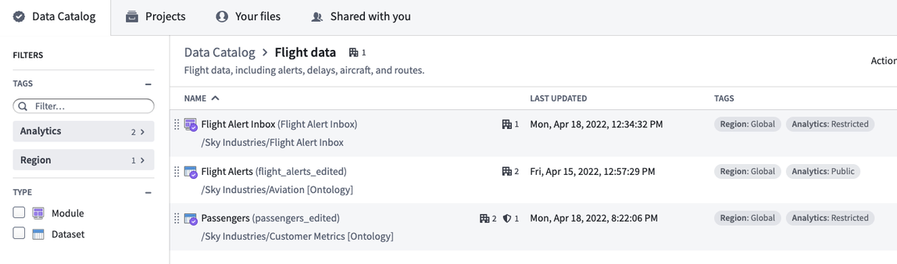
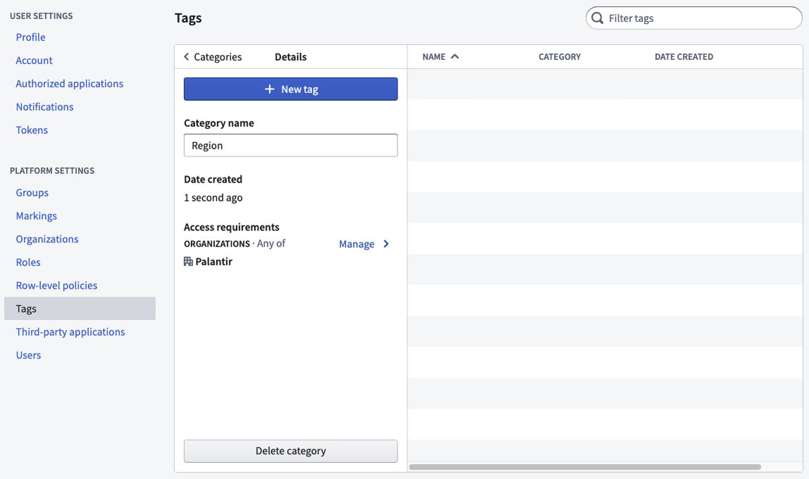
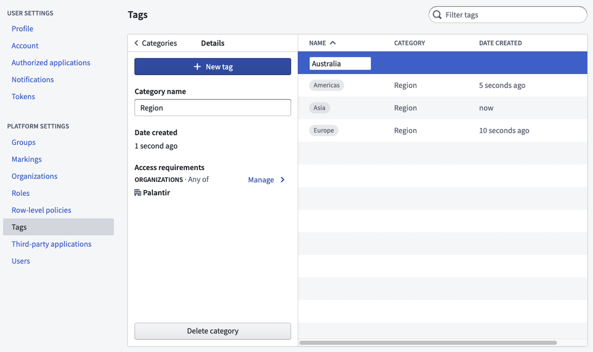

<!-- source: https://palantir.com/docs/foundry/projects/tags/ · mirrored 2026-08-22 from Palantir Foundry docs -->

# Tags

Tags are structured metadata that can be applied to resources for categorization and discovery. Tags are a helpful construct, but they do **not** add or imply security.

Tags are organized into categories; the visibility of each category can be restricted to one or more Organizations. For example, to organize sales data for a large international company you might create tag categories for region (such as “EU”, “APAC”, or “NA”) and financial year (like “2021” or “2022”). Users can then filter collections in the Data Catalog and search by tag.

To generate comprehensive tags, consider the dimensions of your data. Common tag categories include:

* Type or category of data (for instance, you may wish to tag log data differently than reference tables).
* Source system (the external system from which a dataset originates).
* Refresh schedule (such as daily, weekly, or none if static).

Tags related to use cases may also be helpful, such as:

* Region
* Department
* Project

Below is a [Data Catalog](/docs/foundry/compass/data-catalog/) with tagged datasets and a tagged module:

## Manage tags

You can manage tags and tag categories in the **Tags** section of Platform Settings. Select the **New tag category** to create a new tag category. By default, a new tag category will be restricted to the Organization of which you are a member.

After you create a tag category, you can add multiple tags within the category. You can also add additional Organizations to the tag category if you want to expand access.

To delete a tag category, select the category and then **Delete category**. Similarly, to delete a tag, select the tag, then **Delete tag**. You cannot undo delete actions, and the category or tag will be removed from all resources.

## Enable tag usage

Only users granted a role with the "Apply tags to resources in Compass" workflow are able to apply tags to resources. If you do not currently hold a role with this workflow, request an administrator to assign it via the **Organizations permissions** tab in Control Panel.
