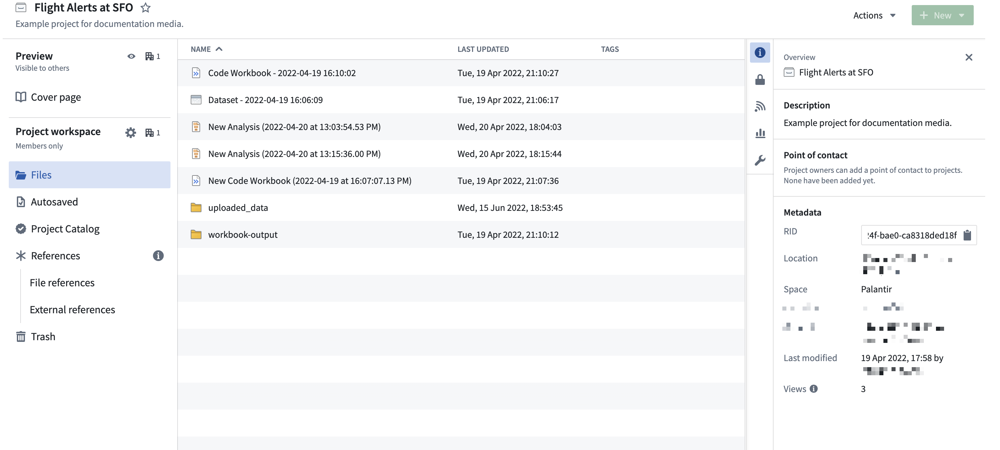
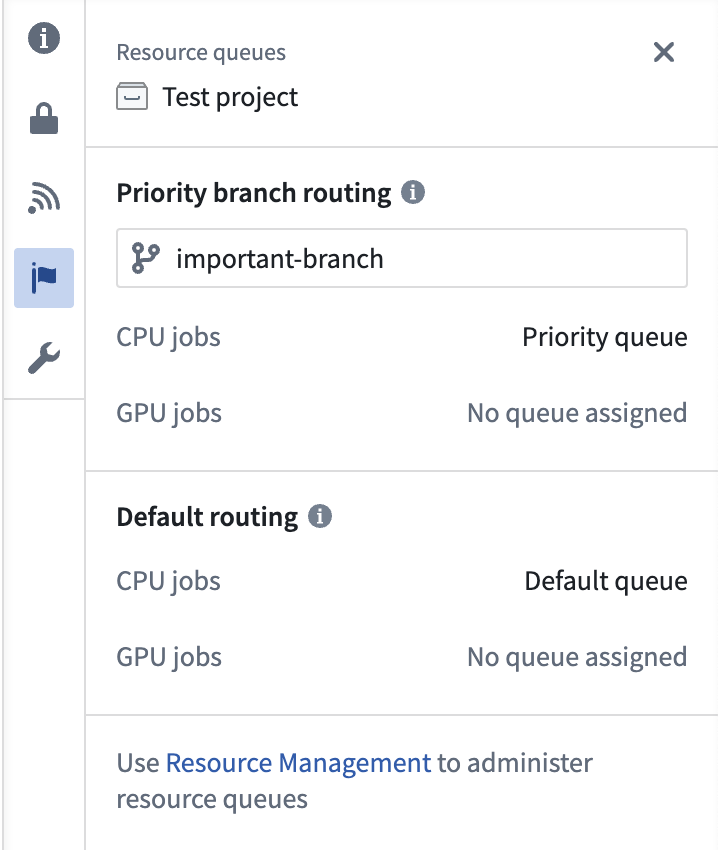

<!-- source: https://palantir.com/docs/foundry/projects/use-project-details-panel/ · mirrored 2026-09-05 from Palantir Foundry docs -->

# Use Project details panel

You can open the resource details panel by selecting one of the right-hand side icons on the Project page.

## Overview

The **Overview** panel gathers general information about the resource, including its resource identifier (RID). On a project's **Files** page and on folder pages, the details panel opens to **Overview** unless it is already showing another panel. To return to it later, select the information icon among the right-hand side icons. The icon's tooltip reads **Overview**.

For a project, **Overview** shows a **Description**, the **Project point of contact**, and a **Metadata** section. Between **Description** and **Project point of contact**, three more sections can appear:

* **Documentation:** A preview of the project's documentation, with an **Add**, **Edit**, or **View** button that opens the [documentation](#documentation) panel. You see this section when the project has documentation or when you can edit the project's metadata.
* **Marketplace installation:** You see this section when a Marketplace installation created the project, or when the project contains installed Marketplace products.
* **Classification:** You see this section when classification-based access control is enabled.

The first field in **Metadata** is **RID**, the project's resource identifier. To copy it, select the copy button at the end of the read-only **RID** field.

The remaining **Metadata** fields, in the order they appear, are **Location**, **Space**, **Iceberg storage**, **Tags**, **Portfolio**, **Status**, **Collections**, **Created**, **Last modified**, and **Views**. Fields are shown only when details are available.

If you can see a project's cover page but not its contents, **Overview** shows a reduced **Metadata** section containing only the project's own **RID**, **Location**, and **Space**.

## Documentation

This section provides a Markdown-based rich text editor to [write documentation at the Project or folder level](/docs/foundry/compass/create-a-project/#add-documentation), similar to all the documentation sections throughout the workspace.

## Activity

The Activity log provides a running view of changes made throughout the Project and is only visible at the Project level. For teams building out a new Project or maintaining a long-term Project, the Activity log makes it easier to understand recent activity and collaboration. Note that the Activity log only stores the last month of activity.

## Discoverability

If necessary, you can make your Project and its description discoverable to people in other organizations. This functionality is under development.

## Access

The **Access** tab in the resource panel allows you to manage group and user access roles within a Project.

For a Project `Owner`, this panel provides an interface to add required markings, manage default access, and configure additional access by granting roles to other users and groups.

For users with a `Viewer` or `Editor` role, the **Access** panel shows an overview of the current groups with Project access.

Learn more about [how projects and roles organize work and control access in Foundry](/docs/foundry/security/projects-and-roles/#roles).

Learn more about [checking someone's permissions on a Project, folder, or file](/docs/foundry/security/checking-permissions/) by using the Check access panel in the workspace sidebar or the Data Lineage tool.

## Resource queues

The **Resource queues** tab allows you to view which [resource queues](/docs/foundry/resource-management/resource-queues/) are assigned to the Project.

