<!-- source: https://palantir.com/docs/foundry/quiver/analysis-canvas/ · mirrored 2026-08-22 from Palantir Foundry docs -->

# Canvas mode

Quiver provides two view mode options for building your analysis; canvas mode and [graph](/docs/foundry/quiver/analysis-graph/) mode. You can see the active view mode and switch between modes with the toggle at the top right corner of the screen. You can optionally choose a [default view mode](/docs/foundry/quiver/analysis-settings/#view-mode-settings) so your analysis always opens to your preference.

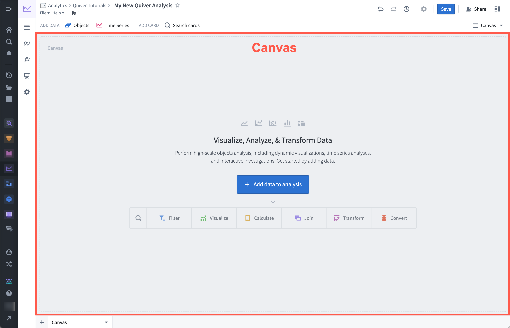

A Quiver canvas is a page where you can display, rearrange, and resize the [cards](/docs/foundry/quiver/core-concepts/#cards) in your analysis. You can create multiple canvases and organize your cards across different canvases. Canvas mode is ideal for organizing a customized view of your analysis, as this mode offers the flexibility to choose which content to display or hide, and the ability to adjust the size and position of cards on the page. As an analysis gets large, organizing cards across multiple canvases can also help improve performance, as only cards on the active canvas are computed.

Unlike a [Contour path](/docs/foundry/contour/core-concepts/#paths), a Quiver canvas is used for display and organization only. Rearranging cards in your canvas will not affect the underlying sequence of data transformation. Similarly, removing a card from your canvas will only delete the card if the card is not referenced by any other cards.

Note that adding cards to your analysis on a canvas will also make them visible in the graph. However, cards added in [graph mode](/docs/foundry/quiver/analysis-graph/) are not automatically placed on a canvas. You can add or remove cards from a canvas at any time through a node's actions menu in graph mode, or by using the **Analysis Contents** panel.

## Add cards to a canvas

When you add cards to your analysis, they will be displayed on the canvas. New cards are commonly added using the [next actions menu](/docs/foundry/quiver/analysis-toolbars/#next-actions-menu) that appears on hover below each card. Adding a card from the next actions menu will add the new card directly below the card that was used to open the next actions menu. You can also add new cards from the **Search cards** window, which can be accessed from the top menu bar. These cards will be placed at the bottom of the canvas. The ordering of the cards does not necessarily indicate dependencies between the cards.

In the example below, we use the next actions menu to add a numeric aggregation based on the object set. Notice that the card is added directly below the object set, and the object set input is already configured.

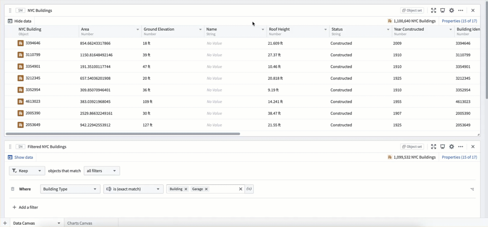

Next, we add the same numeric aggregation using the **Search cards** window. This gets added to the bottom of the canvas, and requires manual configuration of the object set input.

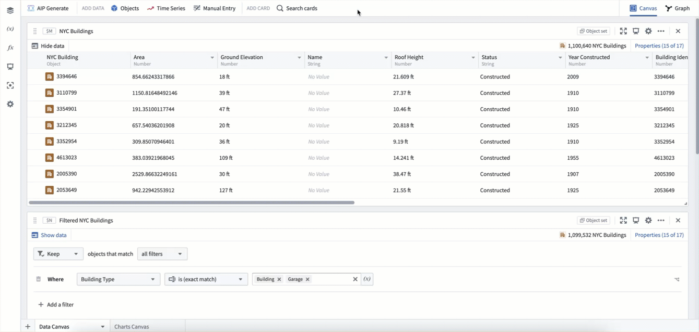

These two numeric aggregation cards were added in different ways and are on different parts of the canvas, but they represent the exact same calculation.

## Create and rename a canvas

A single Quiver analysis can contain multiple canvases. To create a new canvas, select the **+** icon in the lower-left corner. You can also create a new canvas from the [analysis content panel](/docs/foundry/quiver/analysis-toolbars/#analysis-contents-panel) with the **+ New canvas** option.

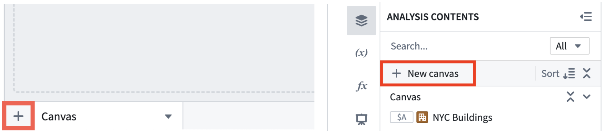

Once created, you can rename a canvas by double clicking the canvas name on the tab at the bottom of your workspace. You can also rename a canvas in the analysis content panel. Find the canvas you want to rename, select the **More actions** icon (**...**), and select **Rename**.

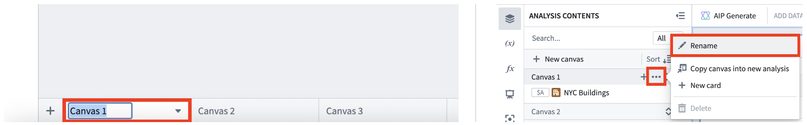

## Resize and rearrange cards on the canvas

You can move cards on the canvas by using the drag handle on the upper-left corner of the card. Select and drag the handle to place the card in the desired location. Cards can also be resized by selecting and dragging the lower-right corner.  In the example below, cards on a canvas are resized and rearranged to make the analysis more presentable.

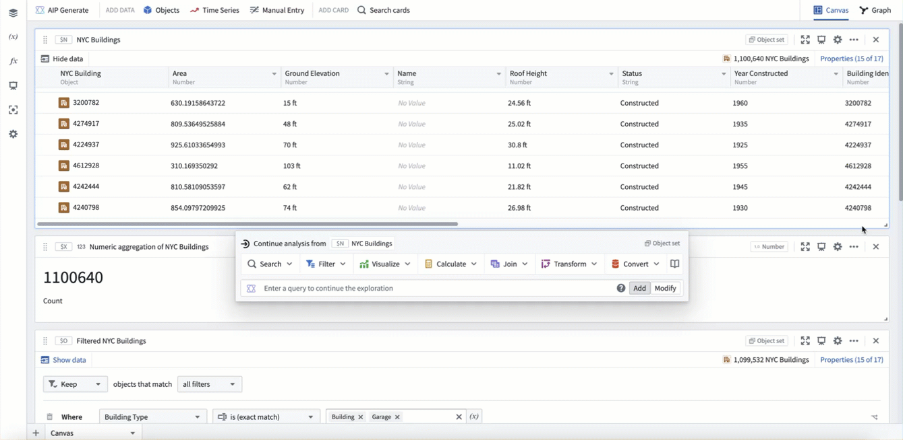

## Move cards between canvases

You can reorder and move cards between canvases by dragging and dropping content in the analysis contents panel.  In the example below, the analysis is split up into three canvases; one for data, one for metrics, and one for charts. This is a common way to keep Quiver analyses organized as they grow.

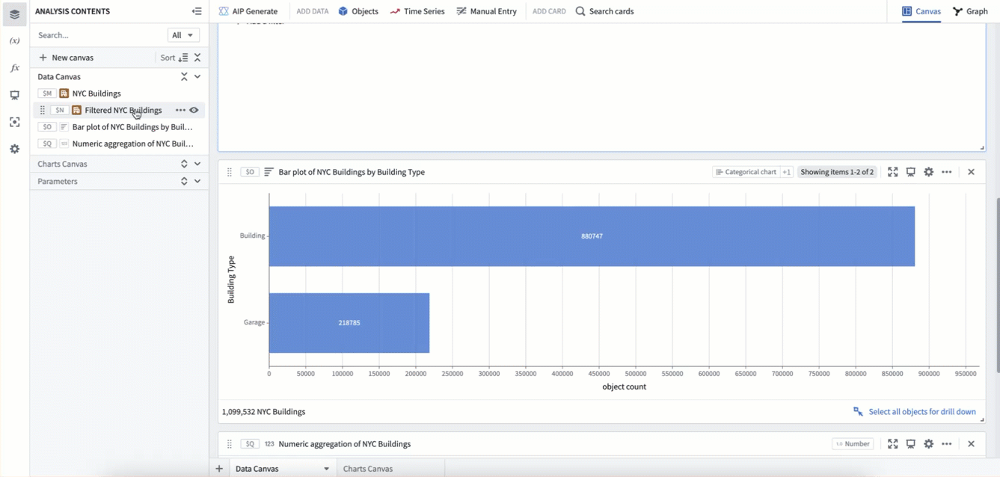

Cards can also be moved between canvases using the **Move to canvas** option in a card's **More actions** menu. Simply select the canvas you would like to move the card to.

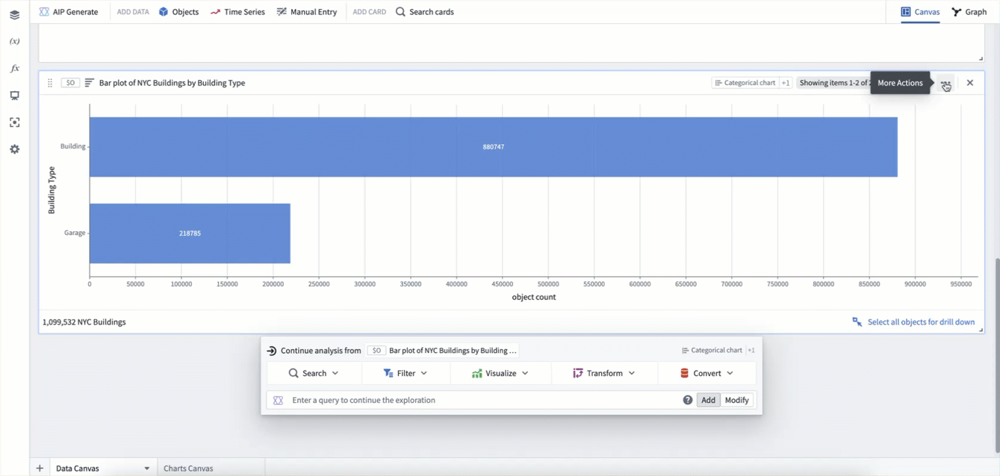

## Copy cards and canvases to other analyses

You can copy cards or canvases to another Quiver analysis to reuse them across analyses.

To copy a card or canvas, open **More actions** and select **Copy to analysis**. You can then select whether to create a new analysis or merge the content into an existing analysis. When copying to an existing analysis, the card or canvas is added to that analysis while preserving any existing content.

## Hide cards

In some cases, you may want to hide cards that contain logic but are not relevant when displaying data. To do this, select the **More actions** menu icon (**...**) from the top right of a card and choose **Hide**. You can also hide and show cards from the **Analysis Contents** panel using the eye icon that appears on hover. Cards that are hidden from the canvas are still visible at the bottom of the **Analysis Contents** panel with a red eye slash icon (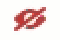). Select the eye slash icon to make the card reappear at the bottom of the canvas.

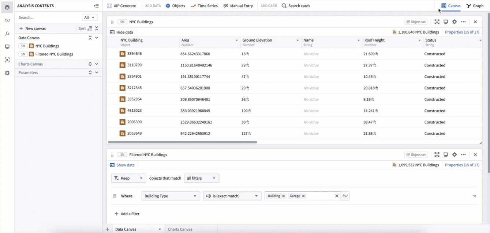

## Delete cards

When you delete a card in canvas mode, a dialog appears with options for how to handle the deletion:

* **Delete and remove from downstream cards:** Removes the card from the analysis entirely. Any cards that use it as an input will have that input configuration set to empty, leaving them in a potentially errored state. If the card has no downstream dependencies, the option will be to **Delete from analysis**.
* **Remove from canvas:** Keeps the card in the analysis and keeps dependent cards unchanged. The card will appear in the **Not in canvas** section of the **Analysis Contents** panel, where it can be configured, added back to a canvas, or deleted.

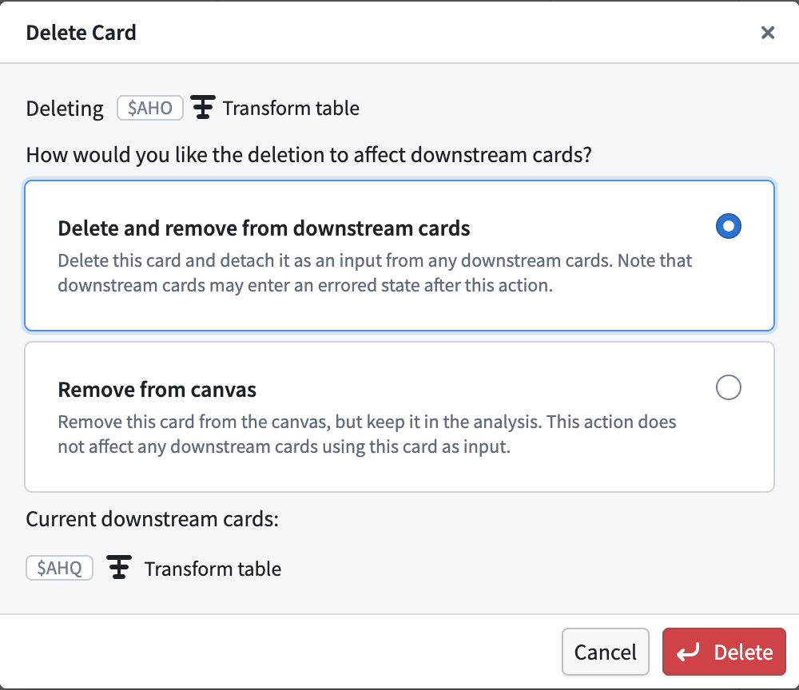

### Delete unused cards

The **Analysis Contents** panel displays **Delete unused cards** when unused cards exist. The button shows the number of unused cards and opens a confirmation dialog that lists the cards before permanently deleting them.

A card is considered unused only if it meets all the following criteria:

* It is not placed on any canvas
* No card on a canvas depends on it
* It is not referenced by any dashboard, function, or global settings entity

Use this option to delete orphaned cards that remain after previous edits or after using **Remove from canvas**.

## Card dependencies

When using canvas mode, you can see all card dependencies (inputs and outputs) in the collapsible **Dependencies** panel at the bottom of the card's editor panel. Selecting an input or output card will open the card's editor panel and scroll to it, simplifying navigation on the canvas.

You can also view card dependencies by using [graph mode](/docs/foundry/quiver/analysis-graph/). By default, the graph shows all cards in the analysis, but you can choose to **View dependencies in graph** to enter a [dependency view](/docs/foundry/quiver/analysis-graph/#dependency-view), which shows only the ancestors and descendants of the selected card.

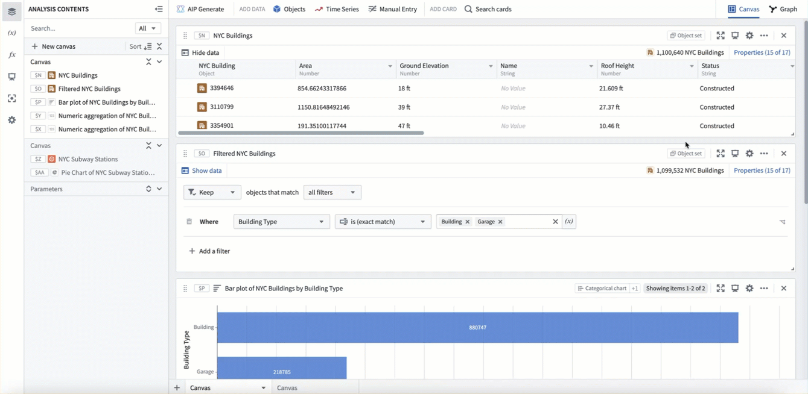
