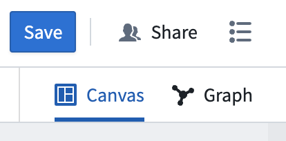
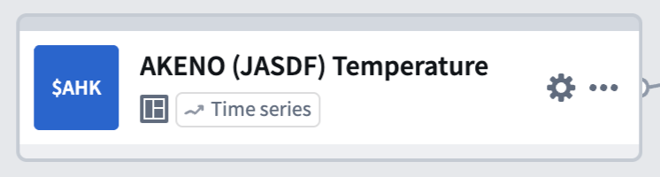
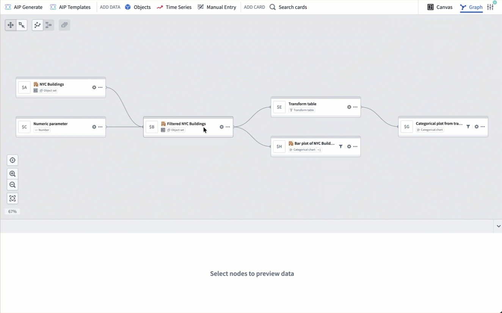
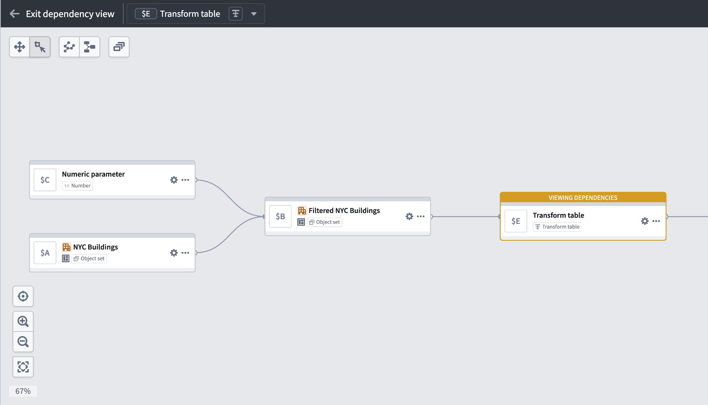
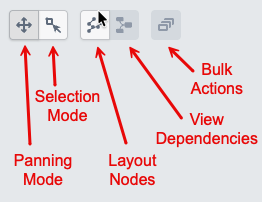
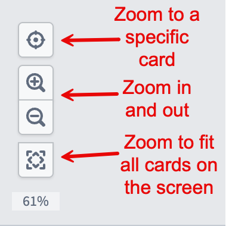

<!-- source: https://palantir.com/docs/foundry/quiver/analysis-graph/ · mirrored 2026-08-18 from Palantir Foundry docs -->

# Graph mode

Quiver provides two view modes for building your analysis: [canvas](/docs/foundry/quiver/analysis-canvas/) mode and graph mode. In graph mode, cards are represented as nodes on a graph, and inputs and outputs are represented by links. The graph uses a left-to-right layout, making it easy to follow the direction of your data.

You can see the active view mode and switch between view modes by using the view mode toggle at the upper-right corner of the screen. You can select your preferred default view mode in [view mode settings](/docs/foundry/quiver/analysis-settings/#view-mode-settings).

## Compact node design

Each node on the graph displays a compact view of its title, identifier, and type. You can access common actions such as configuring inputs, adding the node to a canvas, or deleting the node from its **More actions** menu or by right-clicking on the node. This compact layout keeps the graph fast and responsive, even for large analyses with many cards.

## Preview panel

Card outputs are displayed in a dedicated preview panel at the bottom of the screen. Select a node to see its preview. You can pin previews to keep them visible as you navigate the graph, or view two previews side by side in a split-screen layout. Pinned previews remain open even when you select a different node, making it easy to compare outputs across cards.

## Graph and canvas isolation

Cards added in graph mode are not automatically placed on a canvas. You can add or remove nodes from a canvas at any time through a node's actions menu, so you can focus on building your analysis in the graph and manage canvas placement later.

In canvas mode, you can also remove a card from the canvas without deleting it from the analysis. For more details, review the [delete cards section](/docs/foundry/quiver/analysis-canvas/#delete-cards) in the canvas mode documentation.

## Card deletion

When you delete a card that is used as an input to other cards, a dialog appears with options for how to handle the deletion:

* **Delete and remove from downstream cards:** Removes the card from the analysis entirely and detaches it as an input from any downstream cards. The corresponding input configuration in dependent cards will be set to empty. Note that downstream cards may enter an errored state after this action.
* **Delete this card and all descendants:** Deletes the card along with all cards that depend on it. This is useful for removing an entire branch of the graph at once.

## View cards on the graph

From the canvas, you can switch to graph mode to view card dependencies by choosing one of two options in the **More actions** menu at the top right of a card:

* **View in graph** switches the view to graph mode, centering on the selected card with the context of all other cards on the graph.
* **View dependencies in graph** switches the view to graph mode in [a dependency view](#dependency-view), which shows only the selected card and its dependencies. To see the entire graph again, select **Exit dependency view**.

## Dependency view

In a large analysis, it can be difficult to trace how a specific card was created or which cards depend on it. A dependency view narrows the graph to show only the selected card and its upstream and downstream dependencies.

To enter a dependency view, right-click on a node and select **View dependencies**. You can also enter a dependency view from the canvas by selecting **View dependencies in graph** in a card's **More actions** menu.

To exit a dependency view and see the entire graph, select **Exit dependency view** in the top left of the graph.

## Node interactions

You can interact with nodes on the graph in several ways:

* **Select** a node to highlight it. The card's preview appears in the [preview panel](#preview-panel).
* **Double-click** a node to zoom and center it on the screen and open the card editor on the right side. Where applicable, the [next actions menu](/docs/foundry/quiver/analysis-toolbars/#next-actions-menu) appears below the node.
* **Right-click** a node to open a context menu with actions such as viewing dependencies, hiding the node, managing canvas placement, and assigning color groups.
* **Drag** across the graph background while in **Selection mode** to select multiple nodes for [bulk actions](#bulk-actions).

## Select inputs from graph

When configuring a node in graph mode, you can select its inputs by picking nodes directly from the graph instead of searching through a list. Open the card editor for a node, then select the input field. Eligible nodes on the graph are highlighted, and you can select one to set it as the input. This is particularly useful in large analyses where scrolling through a dropdown would be slower than selecting a nearby node visually.

## Bulk actions

While in **Selection mode**, you can select multiple nodes by dragging across the graph background. Once selected, a toolbar appears in the [graph navigation toolbar](#graph-navigation) with the following actions:

* **Color nodes:** Assign the selected nodes to a [color group](/docs/foundry/quiver/analysis-graph-color-groups/).

* **Hide:** Remove the selected nodes from view without deleting them from the analysis.

* **Canvas organization:** Add the selected nodes to a canvas, move them between canvases, or remove them from a canvas.

* **Copy to new analysis:** Create a new analysis containing copies of the selected nodes.

* **Copy to existing analysis:** Copy the selected nodes to another existing analysis.

* **Delete:** Delete the selected nodes from the analysis.

## Graph navigation

You can adjust the graph layout by selecting and dragging nodes to the desired location. If you want to clean up the layout and reset the nodes to their original position, select **Layout nodes**. You can also switch between **Panning mode** and **Selection mode** to control whether mouse interactions move the graph or select and deselect nodes.

In the bottom left corner of the graph, navigation buttons allow you to zoom in and out, zoom to fit all nodes on the screen, and reset the layout of the graph.

You can also zoom in and out by scrolling up and down on the graph background.

## Organize your graph

As your analysis grows, you can use [color groups](/docs/foundry/quiver/analysis-graph-color-groups/) to assign colors to related nodes and visually distinguish different sections of your graph. Color groups can be collapsed into a single node or hidden to reduce clutter. You can also [hide individual nodes and filter the graph](/docs/foundry/quiver/analysis-graph-organization/) by node type, canvas, dashboard, or function.
