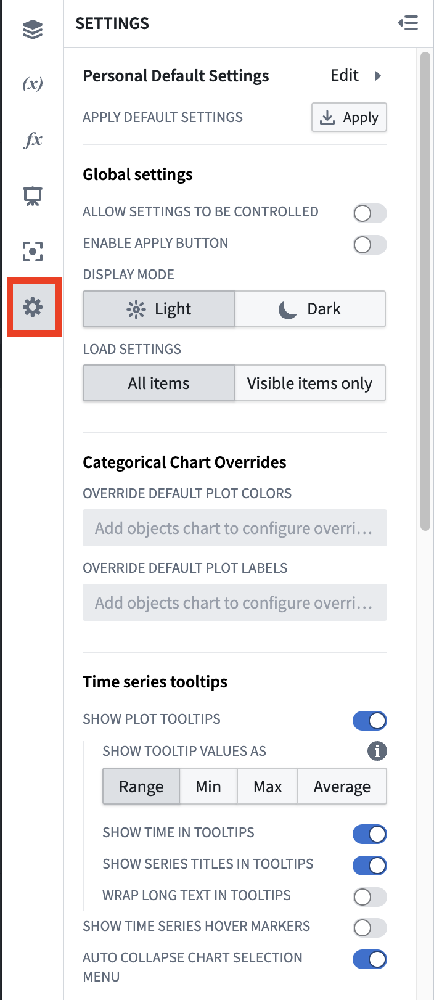
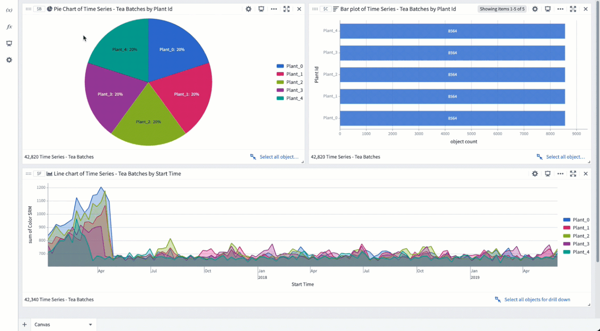
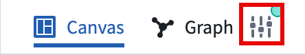
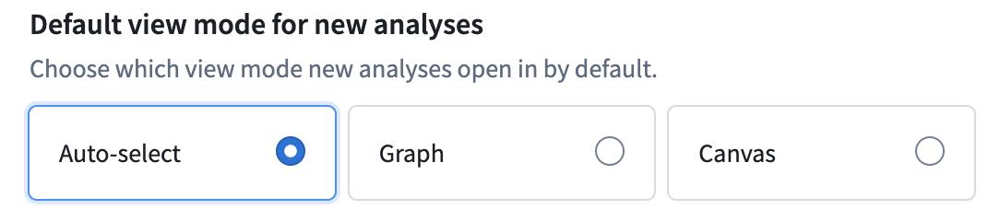

<!-- source: https://palantir.com/docs/foundry/quiver/analysis-settings/ · mirrored 2026-08-18 from Palantir Foundry docs -->

# Settings

Quiver has a range of settings to configure the display and format in your analysis. These apply to the current analysis, but not to other analyses that you create.

To open the settings panel, click the cog icon in the [side panels](/docs/foundry/quiver/analysis-toolbars/#side-panels) bar.

## Personal default settings

Quiver allows you to save your preferred analysis settings. These personal default settings will be automatically applied to any new analysis you create. You also have the option to apply your personal settings to existing analyses.

:::callout{theme="danger"}
Applying your personal default settings to an existing analysis will overwrite existing analysis settings. This will affect other users who work in the analysis as well.
:::

## Global settings

* **Allow settings to be controlled:** When enabled, it is possible to toggle global settings on and off using a Boolean parameter configured in the analysis.
* **Enable apply button:** Enable an apply button that will globally track updates to cards in your analysis, and stop them from propagating to the rest of the analysis until the button is clicked.  This can significantly improve performance for analyses/dashboards where many updates are expected before recomputing results (when changing multiple parameters, for example).
* **Wait for first apply:** If using the apply button, setting this option will prevent the analysis from initially loading until the apply button is clicked.  This can help with performance when the default state of an analysis/dashboard operates on too large of a data scale, and users are expected to apply filters before viewing the analysis.
* **Enable Marketplace linting:** When enabled, Marketplace templating is turned on for all dashboards in the analysis, and [Marketplace](/docs/foundry/devops/core-concepts/#product) validation runs automatically as you interact with the analysis. Errors and warnings appear in a validation indicator next to the **Save** button. You can disable templating for an individual dashboard from its dashboard settings. [Learn more about adding a Quiver dashboard to a Marketplace product.](/docs/foundry/quiver/dashboards-marketplace/)
* **Display mode:** Control whether canvases are displayed in Light mode or Dark mode. The selected mode will apply to all canvases, dashboards, and templates in your analysis. Note that when a dashboard or template is embedded in an application outside of Quiver (e.g. Workshop or Object View), the display mode will be inherited from the parent application.
* **Load settings:** Controls how cards in your canvas are loaded upon opening. Choosing the Visible setting can improve loading performance for large analyses.
  * All: All items in the canvas will be loaded.
  * Visible: Only the visible items in the canvas will be loaded. Remaining items will be loaded as they become visible (e.g. when scrolling down).
  * Default: The current default setting is All.

## Categorical charts overrides

* **Override default plot colors/labels:** These settings allow you to override colors and display names of segments and labels on object charts in your analysis. If changed, local chart display settings take priority over global settings.

  By default, data from different object sets on the same chart will be in different colors; similarly, different segments in a segmented chart will also be colored differently. Without intervention, these colors will be assigned to ensure maximum contrast between categories. You can set global color overrides if desired, whether because of color preferences or because you would like certain segments to be colored the same on all charts throughout the analysis.

  Note that to assign a specific color to each bar in a bar chart, you first need to segment your series by the same property that you grouped by.

## Time series tooltips settings

* **Show plot tooltips:** When this is disabled, you will no longer get a tooltip showing time series name, timestamp, and value when you hover over a time series.
* **Show tooltip values as Range/Min/Max/Average:** By default, Quiver renders 1,000 buckets on each time series chart. This setting is used for high frequency cases where multiple underlying time series points are in a single bucket.
* **Show time in tooltips:** When this is disabled, you will not see the timestamp value when you hover over a time series.
* **Show series titles in tooltips:** When this is disabled, you will not see the time series name when you hover over a time series.
* **Wrap long text in tooltips:** When this is enabled, long text in tooltips will be broken across lines.
* **Show time series hover markers:** When this is enabled, the cursor's hovering crosshairs will also be shown on other charts. This is useful for tracking cursor position across multiple charts.
* **Auto collapse chart selection menu:** When this is enabled, the time series chart selection menu that is created by selecting or dragging a chart will be in a collapsed state by default, with the option to expand it.

## Time series axes and legends

* **Enable analysis wide streaming:** Activates streaming on all axes, enabling cards downstream of time series to refresh their value every time the time series updates. Note that this may negatively impact performance. If your use case does not require downstream cards to reflect streaming updates, enabling the **Stream individual axis** setting in the [time axis configuration](/docs/foundry/quiver/timeseries-visualize/#time-axis-x-axis-configuration) will provide improved performance compared to this setting.
* **Streaming refresh rate:** Controls how often time series plots on streaming-enabled axes will poll new data.
* **Initial default time axis range:** When the default time axis is created, for example, when a time series property is first added to an analysis, it will use this value as its initial range. There are three ways to set this range:
  * **Full data range:** The axis will initialize to the start and end dates of the time series plots on it. This may negatively impact performance for large time series. This is the default for analyses created before this global setting was added.
  * **Fixed range:** The axis will initialize to a static start and end date, for example, from `2025-5-21` to `2025-06-04`.
  * **Relative range:** Sets the view range to a range relative to today, for example, from `2 weeks ago` to `Now`. By default, the range's end date is set to `Now`, but a specific time can be input by selecting the **Set to relative time** toggle on the top right. The default setting for new analyses is a relative range of `2 weeks ago` to `Now`.
* **Show interpolation line:** When this is enabled, Quiver will display a dotted line (marking before and after) when external interpolation is set to anything other than NONE.
* **Show hidden plots in legend:** When this is enabled, hidden plots will be shown in their chart's legend in a grayed out state.
* **Show values in legend:** When this is enabled, the last point of the time series will be displayed under its name in the chart legend.
* **Show time axis scrubber:** When this is enabled, a "scrubber" is displayed on each chart's x-axis. A scrubber is used to independently control the start and end display of charts.
* **Abbreviated numbers in axes:** Controls whether numbers are abbreviated with letters or displayed in full (for example, 120.0k is an abbreviation of 120,000).
* **Group plots by data:** When this is enabled, time series plots with the same root object and data provider will be grouped together in the chart editor and legend. Additional utilities are shown based on the root object, making it easier to pivot between root objects.
* **Overlay y-axes by default:** When this is enabled, y-axes will overlay chart data by default. When this is disabled, y-axes will shift chart data to the side by default.
* **Default y-axis position:** Controls whether the y-axis is displayed on the left or right side of the chart.
* **Default legend position:** Controls whether the legend is displayed on the left or right side of the chart.

## Time series date/number formatting

* **Enable UTC time format:** By default, Quiver displays timestamps using the timezone you're currently in (according to your browser). When this switch is toggled, timestamps will instead be displayed in UTC.
* **Enable 24-hour format:** By default, Quiver displays the time using AM/PM specifications. When this switch is toggled, time will be displayed in 24-hour format. Note that this only affects the time display on a chart’s x-axis, and not on the plot tooltip.
* **Significant figures shown (1-15):** Controls how many significant figures are shown in the plot hover tooltip (default of 6).

## Additional settings

### View mode settings

Choose your preferred view mode so your analysis always opens to your preference. Select the view mode settings toggle in the top right corner of your analysis to learn about new features in a given mode and compare between canvas and graph capabilities. Then select your preferred mode.

If you choose the **Auto-select** option, new analyses will default to [canvas mode](/docs/foundry/quiver/analysis-canvas/) when the first data you add is related to [time series](/docs/foundry/quiver/timeseries-overview/). All other data types will default to [graph mode](/docs/foundry/quiver/analysis-graph/).
