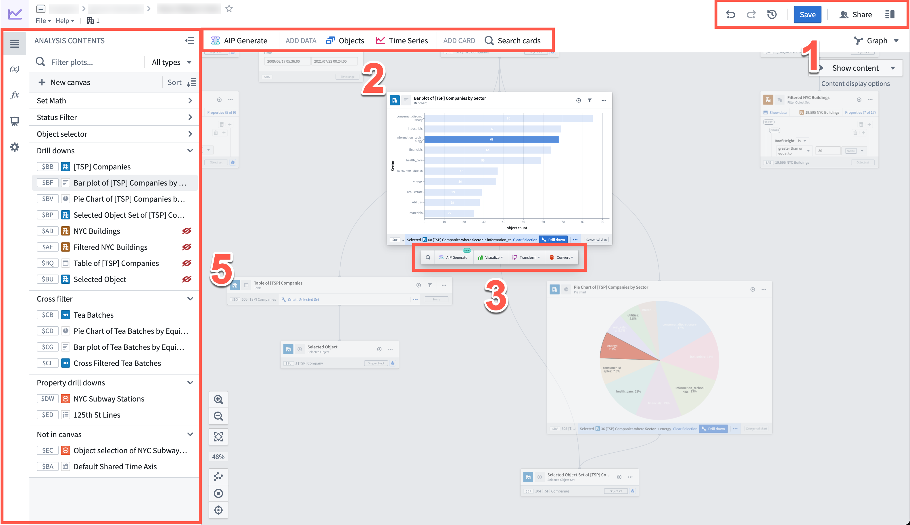
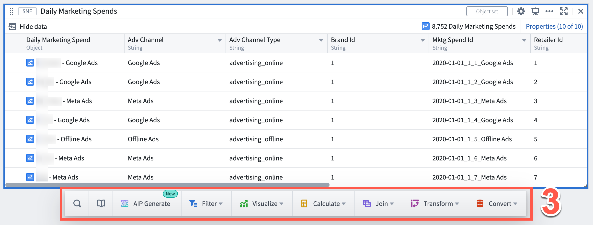
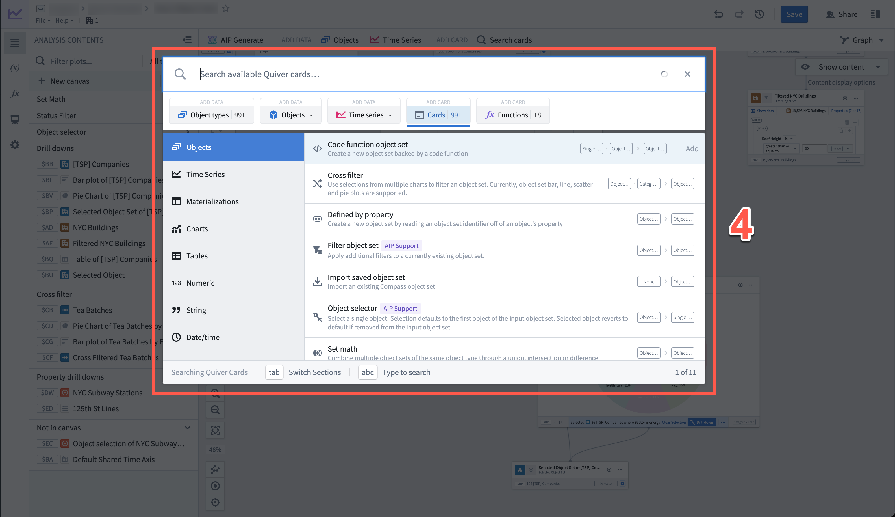
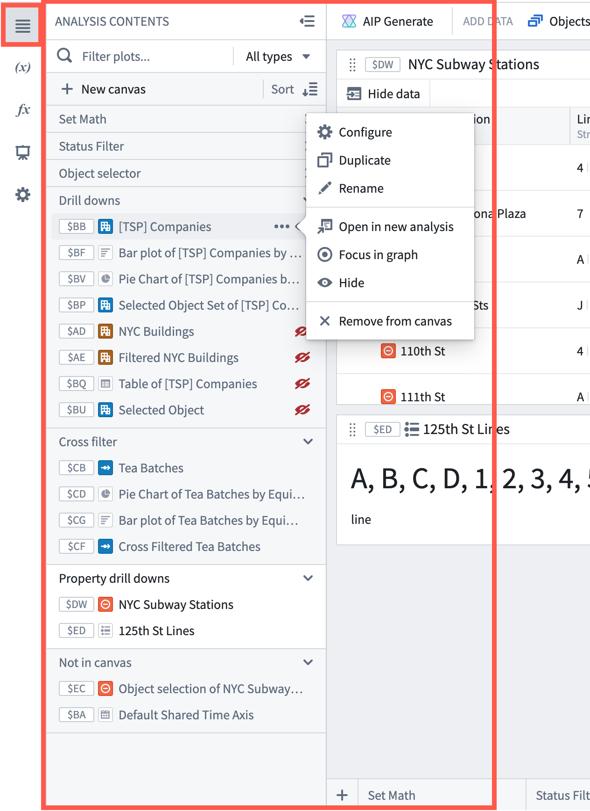
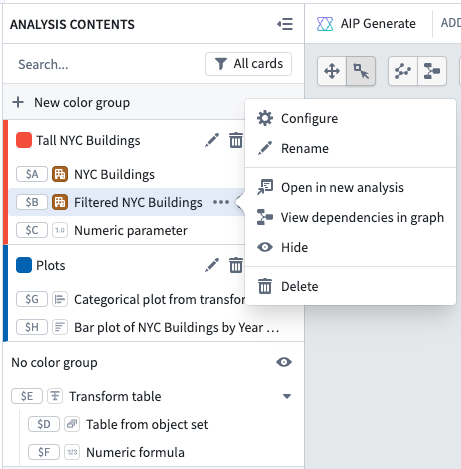

<!-- source: https://palantir.com/docs/foundry/quiver/analysis-toolbars/ · mirrored 2026-08-22 from Palantir Foundry docs -->

# Analysis toolbars

Whether you are conducting your analysis in [canvas mode](/docs/foundry/quiver/analysis-canvas/) or [graph mode](/docs/foundry/quiver/analysis-graph/), you will have access to the same analysis workspace toolbars, consisting of the following components:

* [Analysis workspace header](#analysis-workspace-header)
* [Analysis top bar](#analysis-top-bar)
* [Next actions menu](#next-actions-menu)
* [Search bar](#search-bar)
* [Side panels](#side-panels)
  * [Analysis Contents panel](#analysis-contents-panel)
  * [Parameters panel](#parameters-panel)
  * [Visual Functions panel](#visual-functions-panel)
  * [Dashboards panel](#dashboards-panel)
  * [Settings panel](#settings-panel)

## Analysis workspace header

Marked as `1` in the image, the analysis workspace header provides the following capabilities from left to right:

* **Undo / Redo:** These buttons allow you to undo or redo actions within your analysis.
* **Analysis history** (): Access previous [saved versions](/docs/foundry/quiver/analysis-save-share/) of your analysis or dashboard.
* **Save:** [Save](/docs/foundry/quiver/analysis-save-share/#save-an-analysis) your analysis.
* **Share:** [Share](/docs/foundry/quiver/analysis-save-share/#share-an-analysis) your analysis.
* **Details panel:** To manage access, collaborators, and other analysis metadata.

## Analysis top bar

Marked as `2` in the image above, the analysis top bar allows you to add data and add [cards](/docs/foundry/quiver/core-concepts/#cards) to your analysis.

1. **Data cards:** Opens the [search bar](#search-bar) to add objects or time series to your analysis.
2. **Search cards:** Opens the [search bar](#search-bar), allowing you to search through and interact with all available cards.

## Next actions menu

Marked as `3` in the image above and below, the next actions menu is a toolbar that appears when you hover over a card or a time series plot on the canvas or the graph. From the next actions menu, you can find and perform common actions related to the selected card. Actions are grouped by categories such as filtering, visualizing, calculating, joining, transforming, and converting data.

Note that the specific set of options in the next actions menu will vary depending on the [output type](/docs/foundry/quiver/analysis-data-model/#card-input-and-output-types) of the selected card.

Search for actions across all categories or search within a specific category by using the search option (). Results will include matches from within the category and also highlight matches from other categories.

Available for object and [object set](/docs/foundry/quiver/cards-index-objects/) cards, use the Library option () to discover existing Foundry resources such as Ontology Actions and functions, published Quiver [dashboards](/docs/foundry/quiver/dashboards-overview/) and Quiver [visual functions](/docs/foundry/quiver/visual-functions-overview/) that can take the selected object type as input. Selecting an artifact will add the relevant Quiver card preconfigured with that artifact as input. For example, when selecting an Ontology Action, a Quiver Action button will be added to the analysis preconfigured with the selected Action.

Open **AIP Generate** using the selected card as input to generate an analysis using natural language.

## Search bar

Marked as `4` in the image below, the search bar provides a single point of access to all cards supported in Quiver.

Open the search bar by selecting any item on the [analysis top bar](#analysis-top-bar). Alternatively, you can open the search bar by selecting:

* **+ Add data to analysis** in an empty analysis.
* **+ Add data** in an empty [Analysis Contents panel](#analysis-contents-panel).
* **New card** in the [Analysis Contents panel](#analysis-contents-panel) (hovering on the canvas name).

Cards are grouped in the following tabs:

* **Object types:** Add one or more object sets. This tab features a left-side menu that includes all objects that have configured time series and the [Ontology groups](/docs/foundry/object-link-types/create-object-type/) configured in your Ontology.
* **Objects:** Add one or more specific objects. This tab features a left-side menu with the available object types.
* **Time series:** Add one or more time series objects. This tab features a left-side menu with the available object configured with time series properties.
* **Cards:** Add one of the cards to interact with data. This tab features a left-side menu to categorize cards according to the analytical objective of each. The [data type labels](/docs/foundry/quiver/analysis-data-model/) can help you identify the inputs and outputs supported by each card.
* **Functions:** Search through all available [Functions](/docs/foundry/quiver/visual-functions-overview/) and add them, split by functions for time series and those for objects.

## Side panels

Marked as `5` in the image at the top of the page, select one of the icons on the left side to open the side panels. There are five side panels:

* [Analysis Contents panel](#analysis-contents-panel)
* [Parameters panel](#parameters-panel)
* [Visual Functions panel](#visual-functions-panel)
* [Dashboards panel](#dashboards-panel)
* [Settings panel](#settings-panel)

### Analysis Contents panel

The **Analysis Contents** panel allows you to organize your analysis. There are several functions that can be completed directly in the panel, including:

* Find and organize content
  * Search for specific cards by typing their global ID or title
  * Filter by text and data type
  * Drag and drop content to move between sections (or rearrange on canvas when in canvas mode)

In [canvas mode](/docs/foundry/quiver/analysis-canvas/), every card is listed in the order it appears on the canvas. The following actions are available:

* **Configure:** Open the editor to configure a card
* **Duplicate:** Create a copy of the card in the same analysis
* **Rename:** Edit the card title
* **Open in new analysis:** Duplicate the card along with its upstream [dependencies](/docs/foundry/quiver/analysis-canvas/#card-dependencies) to a new analysis
* **View dependencies in graph:** Switch to graph mode in [a dependency view](/docs/foundry/quiver/analysis-graph/#dependency-view)
* **Hide:** Hide a card from the canvas
* **Delete:** Remove the card from the analysis. If the card has downstream dependencies, you will get a [dialog](/docs/foundry/quiver/analysis-canvas/#delete-cards) with options on how to handle it.

Card actions can be found by selecting the **More actions** icon () that appears when hovering over a card in the list.

In [graph mode](/docs/foundry/quiver/analysis-graph/), cards are listed based on the [color group](/docs/foundry/quiver/analysis-graph-color-groups/) they belong to. You can also [filter](/docs/foundry/quiver/analysis-graph-organization/#filter-nodes) the graph based on data type or by canvases/dashboards/visual functions. The actions available from the **Analysis Contents** panel include:

* **Configure:** Open the editor to configure a card
* **Rename:** Edit the card title
* **Open in new analysis:** Duplicate the card along with its upstream [dependencies](/docs/foundry/quiver/analysis-canvas/#card-dependencies) to a new analysis
* **View dependencies in graph:** Switch to graph mode in [a dependency view](/docs/foundry/quiver/analysis-graph/#dependency-view)
* **Hide:** [Hide](/docs/foundry/quiver/analysis-graph-organization/#hide-nodes) a card on the graph
* **Delete:** Remove the card from the analysis. If the card has downstream dependencies, you will get a [dialog](/docs/foundry/quiver/analysis-graph/#card-deletion) with options on how to handle it.

### Parameters panel

More information about the Parameters panel can be found in the documentation on [how to parameterize an analysis](/docs/foundry/quiver/cards-parameters/#the-parameters-panel).

### Visual Functions panel

More information about the Visual Functions panel can be found in the documentation on [how to use visual functions](/docs/foundry/quiver/visual-functions-overview/).

### Dashboards panel

More information about the Dashboards panel can be found in the documentation on [how to use dashboards](/docs/foundry/quiver/dashboards-overview/).

### Settings panel

More information about the Settings panel can be found in the documentation on [how to change the analysis settings](/docs/foundry/quiver/analysis-settings/).
