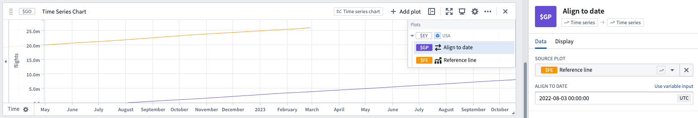

<!-- source: https://palantir.com/docs/foundry/quiver/card-align-to-date/ · mirrored 2026-08-18 from Palantir Foundry docs -->

# Align to date

Generate a new time series by shifting the start of an input series to a specified date.

## Input type

Time series

## Output type

Time series

## Examples

## Usage information

| Functionality | Availability |
| --- | --- |
| [Standard Quiver card](/docs/foundry/quiver/core-concepts/#cards) | Supported |
| [Transform table transform](/docs/foundry/quiver/cards-transform-table/) | Supported |

## See also

* [Align series to event set](/docs/foundry/quiver/card-align-series-to-event-set/)
* [Shift time series](/docs/foundry/quiver/card-shift-time-series/)
