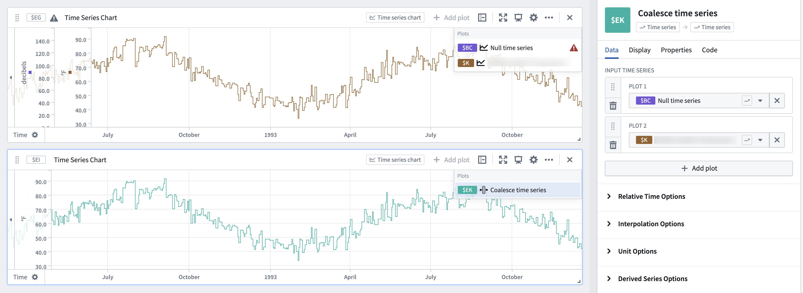

<!-- source: https://palantir.com/docs/foundry/quiver/card-coalesce-time-series/ · mirrored 2026-08-18 from Palantir Foundry docs -->

# Coalesce time series

The coalesce time series card returns the first time series that is not null or errored, or null if all input series are null. This card is useful for casting potential null series to a defined series. To do this, use a variable input to select a card or column value that is potentially null as the first array value. For the second array value, choose a non-null "fallback" time series for cases when the first value is null.

## Input type

Time series array

## Output type

Time series

## Examples

## Usage information

| Functionality | Availability |
| --- | --- |
| [Standard Quiver card](/docs/foundry/quiver/core-concepts/#cards) | Supported |
| [Transform table transform](/docs/foundry/quiver/cards-transform-table/) | Supported |

## See also

* [Coalesce](/docs/foundry/quiver/card-coalesce/)
