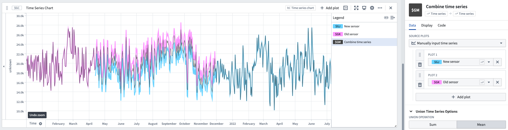

<!-- source: https://palantir.com/docs/foundry/quiver/card-combine-time-series/ · mirrored 2026-08-22 from Palantir Foundry docs -->

# Combine time series

The **Combine time series** transformation operates on two or more series, merging all time points from the input series. The union operation specifies how to handle overlapping time points. For example, if the mean union operation is selected, the value for any shared time point is computed as the mean of the values from each series at that time.

The **Combine time series** card does not use interpolation when joining series together. For each timestamp, the **Combine time series** card combines the data for any series which actually contains a data point at that timestamp. This differs from the [**Linear aggregation** card](/docs/foundry/quiver/card-linear-aggregation/), which does use interpolation when joining together multiple series. [Learn more about how interpolation affects the Combine time series card.](/docs/foundry/quiver/cards-interpolation-usage/#combine-time-series)

## Input type

Time series

## Output type

Time series

## Examples

## Usage information

| Functionality | Availability |
| --- | --- |
| [Standard Quiver card](/docs/foundry/quiver/core-concepts/#cards) | Supported |
| [Transform table transform](/docs/foundry/quiver/cards-transform-table/) | Supported\* |

\* In the transform table, in addition to combine time series, you can use the "combine time series group" transform to combine a time series group column (result of a group by transform).

## See also

* [Linear aggregation](/docs/foundry/quiver/card-linear-aggregation/)
