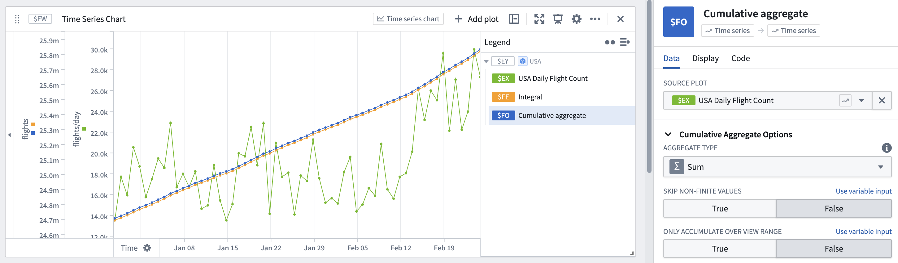

<!-- source: https://palantir.com/docs/foundry/quiver/card-cumulative-aggregate/ · mirrored 2026-08-22 from Palantir Foundry docs -->

# Cumulative aggregate

Cumulative aggregates allow you to display the cumulative value of a series, either over the entire length of the series or over a specific period of time. For example, if we had a series representing the dividend payout of Disney stock over time, we could use a Cumulative aggregate sum to see the running total of dividend payout as it grows with time.

* There is an **only accumulate over view range** toggle. By default, Cumulative aggregates will only calculate over the display range. If you would like to calculate the cumulative aggregate for the entire range of the series, switch this toggle to false.

## Input type

Time series

## Output type

Time series

## Examples

## Usage information

| Functionality | Availability |
| --- | --- |
| [Standard Quiver card](/docs/foundry/quiver/core-concepts/#cards) | Supported |
| [Transform table transform](/docs/foundry/quiver/cards-transform-table/) | Supported |

## See also

[Integral](/docs/foundry/quiver/card-integral/)
