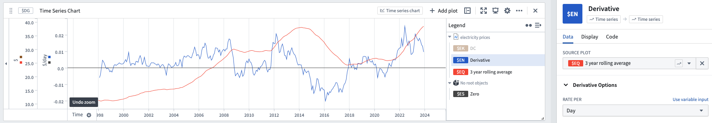

<!-- source: https://palantir.com/docs/foundry/quiver/card-derivative/ · mirrored 2026-08-18 from Palantir Foundry docs -->

# Derivative

The Derivative plot shows the rate of change at each given point in the selected input series.

* The default is to calculate the rate of change per second. This can be changed to several other options. Note that this does not affect the shape of the curve, only the y-axis units.
* Derivatives are useful for identifying when the slope of a series is flat (that is, not changing.) To find periods where a series is not changing, you can do a [Time Series Search](/docs/foundry/quiver/card-time-series-search/) for periods when the derivative of the series is close to zero.

## Input type

Time series

## Output type

Time series

### Example

## Usage information

| Functionality | Availability |
| --- | --- |
| [Standard Quiver card](/docs/foundry/quiver/core-concepts/#cards) | Supported |
| [Transform table transform](/docs/foundry/quiver/cards-transform-table/) | Supported |
