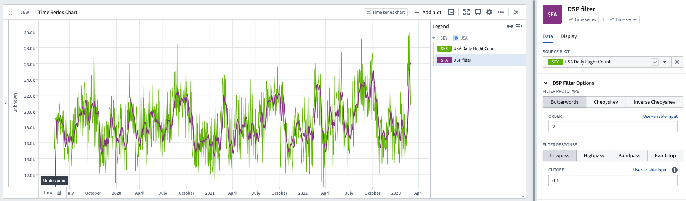

<!-- source: https://palantir.com/docs/foundry/quiver/card-dsp-filter/ · mirrored 2026-08-18 from Palantir Foundry docs -->

# Digital Signal Processing (DSP) filter

DSP (digital signal processing) filters are commonly used on input series to reduce their noise. This is typically a more rigorous option to "smooth" a series than using a [rolling aggregate](/docs/foundry/quiver/card-rolling-aggregate/).

Quiver includes three separate filtering algorithms/prototypes:

* [Butterworth ↗](https://en.wikipedia.org/wiki/Butterworth_filter)
* [Chebyshev ↗](https://en.wikipedia.org/wiki/Chebyshev_filter)
* [Inverse Chebyshev ↗](https://en.wikipedia.org/wiki/Chebyshev_filter).

For each algorithm, a filter response must be selected from the following options:

* [Lowpass ↗](https://en.wikipedia.org/wiki/Low-pass_filter)
* [Highpass ↗](https://en.wikipedia.org/wiki/High-pass_filter)
* [Bandpass ↗](https://en.wikipedia.org/wiki/Band-pass_filter)
* [Bandstop ↗](https://en.wikipedia.org/wiki/Band-stop_filter)

## Input type

Time series

## Output type

Time series

### Example

## Usage information

| Functionality | Availability |
| --- | --- |
| [Standard Quiver card](/docs/foundry/quiver/core-concepts/#cards) | Supported |
| [Transform table transform](/docs/foundry/quiver/cards-transform-table/) | Supported |
