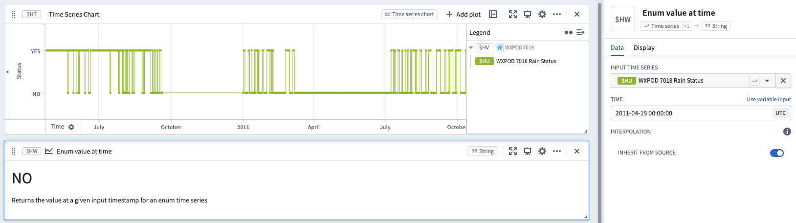

<!-- source: https://palantir.com/docs/foundry/quiver/card-enum-value-at-time/ · mirrored 2026-08-22 from Palantir Foundry docs -->

# Enum value at time

Returns the value of an enum (string) time series at a given input timestamp.

[Learn more about how interpolation affects this operation.](/docs/foundry/quiver/cards-interpolation-usage/#value-at-time)

## Input type

Time series

## Output type

String

## Examples

## Usage information

| Functionality | Availability |
| --- | --- |
| [Standard Quiver card](/docs/foundry/quiver/core-concepts/#cards) | Supported |
| [Transform table transform](/docs/foundry/quiver/cards-transform-table/) | Supported |

## See also

* [Value at time](/docs/foundry/quiver/card-value-at-time/)
* [Latest value for enum time series](/docs/foundry/quiver/card-latest-value-for-enum-time-series/)
