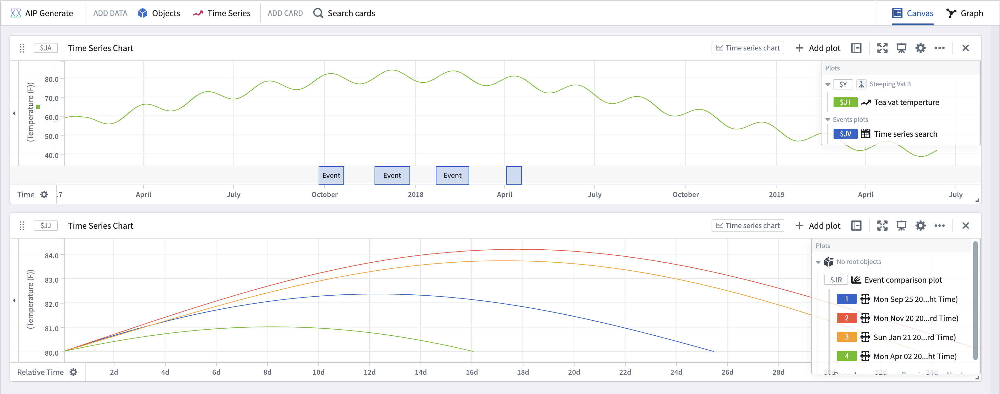

<!-- source: https://palantir.com/docs/foundry/quiver/card-event-comparison-plot/ · mirrored 2026-08-18 from Palantir Foundry docs -->

# Event comparison plot

Compare the behavior of a time series across multiple events by isolating and aligning the segments of the time series where each event is occurring. The plot displays the time series segments in [relative time](/docs/foundry/quiver/timeseries-relative-time/), so that the value at the each event's start time is aligned to zero. The image below shows how the event comparison plot can be used to visualize the behavior of temperature in a tea vat over 80 degrees.

## Input type

Time series + event set

## Output type

Time series group

## Examples

## Usage information

| Functionality | Availability |
| --- | --- |
| [Standard Quiver card](/docs/foundry/quiver/core-concepts/#cards) | Supported |
| [Transform table transform](/docs/foundry/quiver/cards-transform-table/) | Unsupported |

## See also

[Reference profile bounds](/docs/foundry/quiver/card-reference-profile-bounds/)
