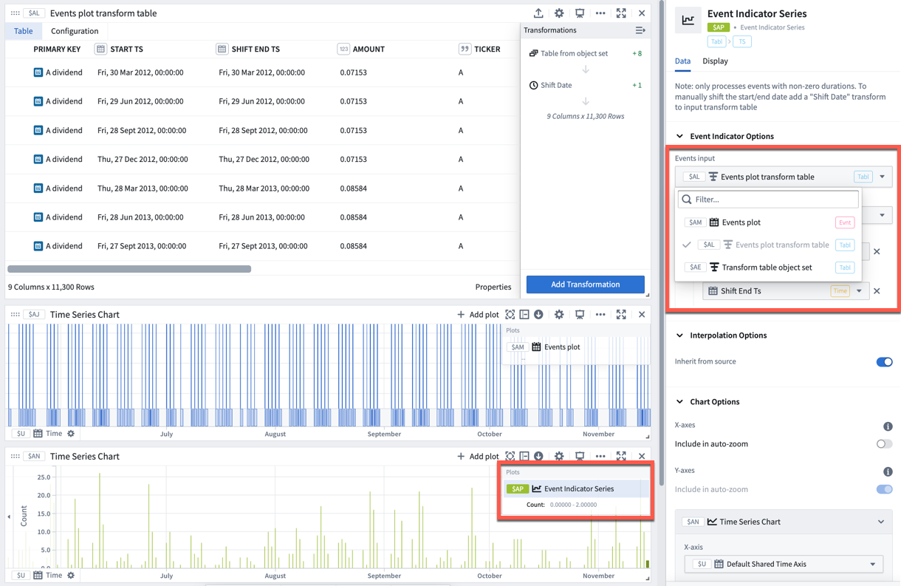

<!-- source: https://palantir.com/docs/foundry/quiver/card-event-indicator-series/ · mirrored 2026-08-22 from Palantir Foundry docs -->

# Event indicator series

An event indicator series creates a time series out of an event set indicating the number of events occurring at a given time.

* Note that only events with non-zero durations will be plotted.
* To manually shift the start or end time of the events, use the [time shift event set](/docs/foundry/quiver/card-time-shift-event-set/) card to modify the input event set.

## Input type

Event set

## Output type

Time series

## Examples

## Usage information

| Functionality | Availability |
| --- | --- |
| [Standard Quiver card](/docs/foundry/quiver/core-concepts/#cards) | Supported |
| [Transform table transform](/docs/foundry/quiver/cards-transform-table/) | Unsupported |
