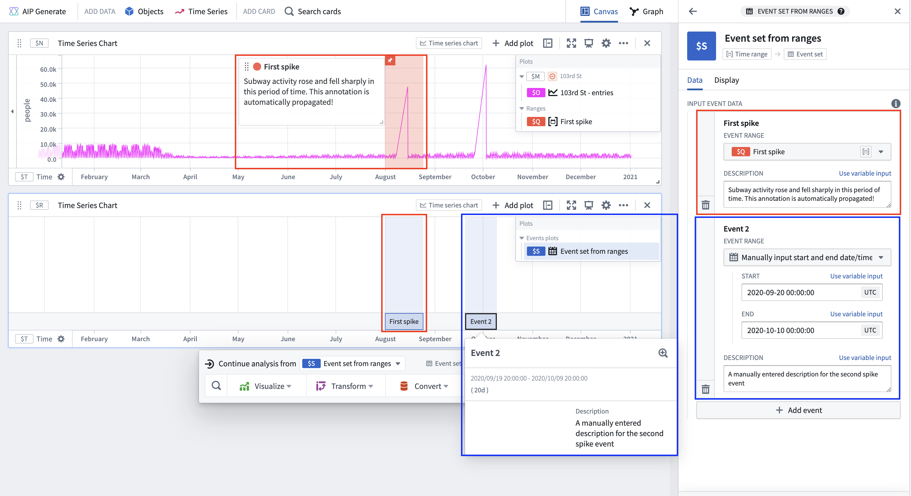

<!-- source: https://palantir.com/docs/foundry/quiver/card-event-set-from-ranges/ · mirrored 2026-08-22 from Palantir Foundry docs -->

# Event set from ranges

Create an event set by specifying a list of time ranges for each event. Create each event by selecting a range parameter, or separately inputting start and end timestamps. Customize the title and description that appear in an event's tooltip by editing the corresponding fields in the **Input event data** section in the **Data** tab of the editor panel. When a range parameter is used, its title and annotation automatically populate the event's title and description, if available.

## Input type

Time ranges

## Output type

Event set

## Examples

## Usage information

| Functionality | Availability |
| --- | --- |
| [Standard Quiver card](/docs/foundry/quiver/core-concepts/#cards) | Supported |
| [Transform table transform](/docs/foundry/quiver/cards-transform-table/) | Unsupported |

## See also

* [Event set from tabular data](/docs/foundry/quiver/card-event-set-from-tabular-data/)
* [Linked event set](/docs/foundry/quiver/card-linked-event-set/)
