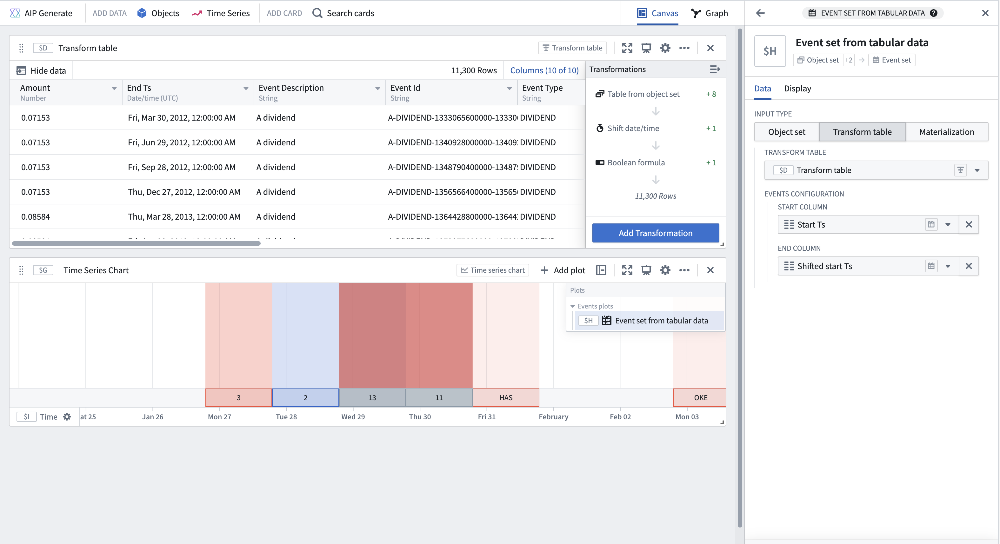

<!-- source: https://palantir.com/docs/foundry/quiver/card-event-set-from-tabular-data/ · mirrored 2026-08-18 from Palantir Foundry docs -->

# Event set from tabular data

Create an event set from a tabular data source such as an object set, transform table, or materialization. The start and end timestamps of each event are populated using a column or property from the input table, specified in the **Events configuration** settings in the **Data** tab of the editor panel.

## Input type

Transform table, object set, or materialization

## Output type

Event set

## Examples

## Usage information

| Functionality | Availability |
| --- | --- |
| [Standard Quiver card](/docs/foundry/quiver/core-concepts/#cards) | Supported |
| [Transform table transform](/docs/foundry/quiver/cards-transform-table/) | Unsupported |

## See also

[Event set from ranges](/docs/foundry/quiver/card-event-set-from-ranges/)
