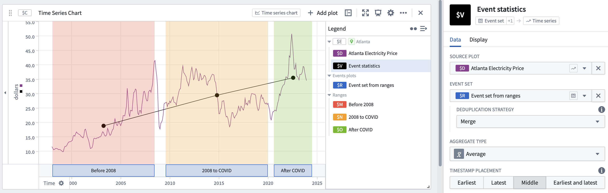

<!-- source: https://palantir.com/docs/foundry/quiver/card-event-statistics/ · mirrored 2026-08-18 from Palantir Foundry docs -->

# Event statistics

Aggregate a time series plot over intervals where an event occurs. This card will return a new time series with one point per event.

## Input type

Time series

## Output type

Time series

## Examples

## Usage information

| Functionality | Availability |
| --- | --- |
| [Standard Quiver card](/docs/foundry/quiver/core-concepts/#cards) | Supported |
| [Transform table transform](/docs/foundry/quiver/cards-transform-table/) | Supported |

## See also

[Segment statistics](/docs/foundry/quiver/card-segment-statistics/)
