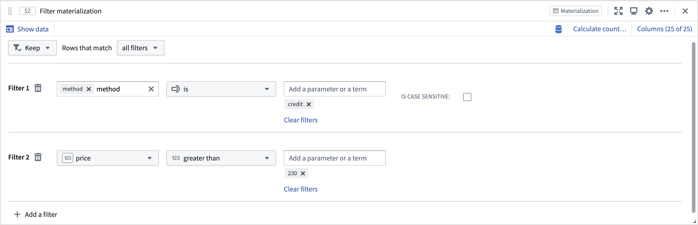

<!-- source: https://palantir.com/docs/foundry/quiver/card-filter-materialization/ · mirrored 2026-08-22 from Palantir Foundry docs -->

# Filter materialization

Apply additional filters to a materialization. Select an object set on which to apply conditions.

## Input type

Materialization

## Output type

Materialization

## Usage information

| Functionality | Availability |
| --- | --- |
| [Standard Quiver card](/docs/foundry/quiver/core-concepts/#cards) | Supported |
| [Transform table transform](/docs/foundry/quiver/cards-transform-table/) | Unsupported |
