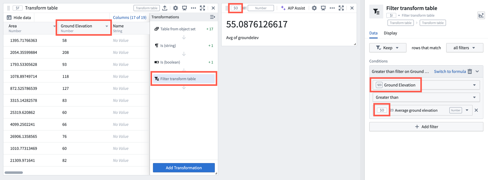
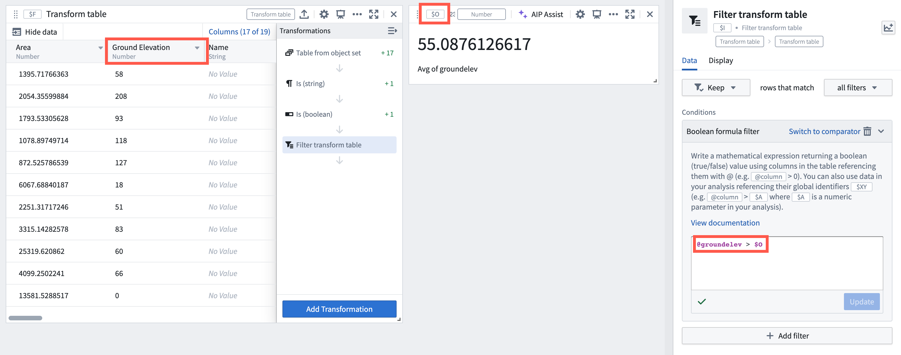

<!-- source: https://palantir.com/docs/foundry/quiver/card-filter-transform-table/ · mirrored 2026-08-18 from Palantir Foundry docs -->

# Filter transform table

Keep or remove transform table rows that match any or all conditions based on column values and data in your analysis.

Conditions can be defined either using formulas or a visual editor. To add a condition, select **+ Add filter**.

### Filter using a visual editor

To configure a condition, select a column. Supported columns types are string, date, number, and Boolean.

Once a column is selected, select the comparison operator to configure the condition. Each column type offers a different set of comparison operators:

* **String:** Starts with, ends with, contains, does not contain, is, is not, string to Boolean (to be used when a String column contains true or false values)
* **Date:** Before, on or before, after, on or after, between (inclusive), on, not on
* **Number:** Greater than, greater than or equal to, less than, less than or equal to, equal to, not equal to
* **Boolean:** Is, is not

The image below shows a condition configuration for a `greater than` comparison operator, comparing a number column "Ground Elevation" with the average value of that column computed by a numeric aggregation.

### Filter using a formula

To configure a condition, [specify a formula](/docs/foundry/quiver/cards-formula-syntax/) returning a Boolean (true/false). The formulas can take columns as input, referencing them with `@` (for example,`@column > 0`). You can also use data in your analysis referencing their global identifiers `$XY` (for example, `@column > $A` where `$A` is a numeric parameter in your analysis).

Note that string types are not supported in formulas. To filter on string column type, use the visual editor.

The image below shows the same condition as the one configured above using the visual editor, but is alternatively using a formula. It uses the `greater than` comparison operator, comparing a number column "Ground Elevation" called `groundelev` with the average value of that column computed by a numeric aggregation with a global identifier `$O`.

## Input type

Transform table

## Output type

Transform table

## Usage information

| Functionality | Availability |
| --- | --- |
| [Standard Quiver card](/docs/foundry/quiver/core-concepts/#cards) | Unsupported |
| [Transform table transform](/docs/foundry/quiver/cards-transform-table/) | Supported |
