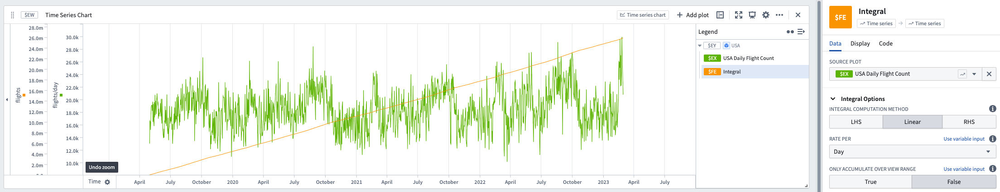

<!-- source: https://palantir.com/docs/foundry/quiver/card-integral/ · mirrored 2026-08-22 from Palantir Foundry docs -->

# Integral

The Integral transformation is the inverse of the [derivative](/docs/foundry/quiver/card-derivative/). Rather than calculating rate of change, it calculates the area under the curve.

* As with derivatives, you can calculate the rate over several different time units.
* In addition to linear integration, you can also perform LHS and RHS integration using the **Integration Method** option.
* There is an **only accumulate over view range** toggle. By default, integrals will calculate over the entire range of the series. If you are zoomed in and only want to integrate over the time range displayed, switch this toggle to true.

## Input type

Time series

## Output type

Time series

### Example

## Usage information

| Functionality | Availability |
| --- | --- |
| [Standard Quiver card](/docs/foundry/quiver/core-concepts/#cards) | Supported |
| [Transform table transform](/docs/foundry/quiver/cards-transform-table/) | Supported |
