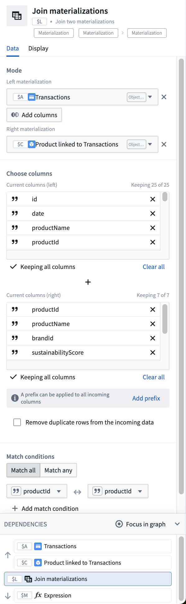

<!-- source: https://palantir.com/docs/foundry/quiver/card-join-materializations/ · mirrored 2026-09-04 from Palantir Foundry docs -->

# Join datasets

Performs a left, inner, or right join of two datasets. Select which columns of data you wish to retain from the source and joining datasets. Optionally, add a prefix to incoming columns to avoid name collisions with existing columns, or to annotate the joined columns.

This is useful if you are trying to perform a visualization or calculation using properties across linked objects in the ontology. The native object set card [switch to linked object set](/docs/foundry/quiver/card-switch-to-linked-object-set/) will only perform a link traversal, resulting in the linked objects, but will not retain the original object information in the same row.

Alternatively, at smaller scales (less than 50,000 objects), a [join to linked objects](/docs/foundry/quiver/card-join-to-linked-objects/) card can be used in the transform table.

## Input type

Object set, dataset

## Output type

Dataset

## Usage information

| Functionality | Availability |
| --- | --- |
| [Standard Quiver card](/docs/foundry/quiver/core-concepts/#cards) | Supported |
| [Transform table transform](/docs/foundry/quiver/cards-transform-table/) | Unsupported |

## See also

* [Join to linked objects](/docs/foundry/quiver/card-join-to-linked-objects/)
* [Switch to linked object set](/docs/foundry/quiver/card-switch-to-linked-object-set/)
