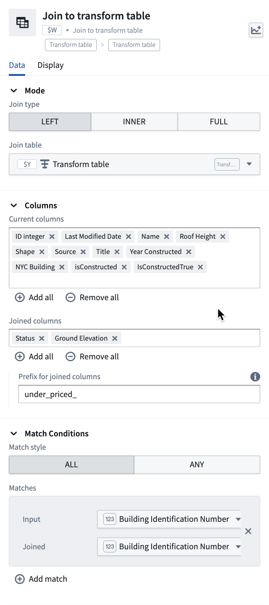

<!-- source: https://palantir.com/docs/foundry/quiver/card-join-to-transform-table/ · mirrored 2026-08-18 from Palantir Foundry docs -->

# Join to transform table

Performs a left, inner or right join of two transform tables based on one or more matching conditions.
Select which columns from the source and joining tables you wish to retain.
Optionally, add a prefix to the joined columns to avoid name collisions with existing columns, or to annotate the joined columns.

## Input type

Transform table

## Output type

Transform table

## Usage information

| Functionality | Availability |
| --- | --- |
| [Standard Quiver card](/docs/foundry/quiver/core-concepts/#cards) | Unsupported |
| [Transform table transform](/docs/foundry/quiver/cards-transform-table/) | Supported |
