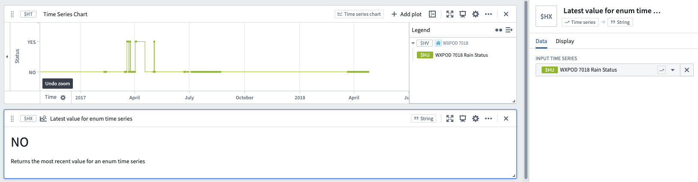

<!-- source: https://palantir.com/docs/foundry/quiver/card-latest-value-for-enum-time-series/ · mirrored 2026-08-18 from Palantir Foundry docs -->

# Latest value for enum time series

Returns the value of an enum (string) time series at its last timestamp.

## Input type

Enum time series

## Output type

String

## Examples

## Usage information

| Functionality | Availability |
| --- | --- |
| [Standard Quiver card](/docs/foundry/quiver/core-concepts/#cards) | Supported |
| [Transform table transform](/docs/foundry/quiver/cards-transform-table/) | Supported |

## See also

* [Enum value at time](/docs/foundry/quiver/card-enum-value-at-time/)
* [Value at time](/docs/foundry/quiver/card-value-at-time/)
