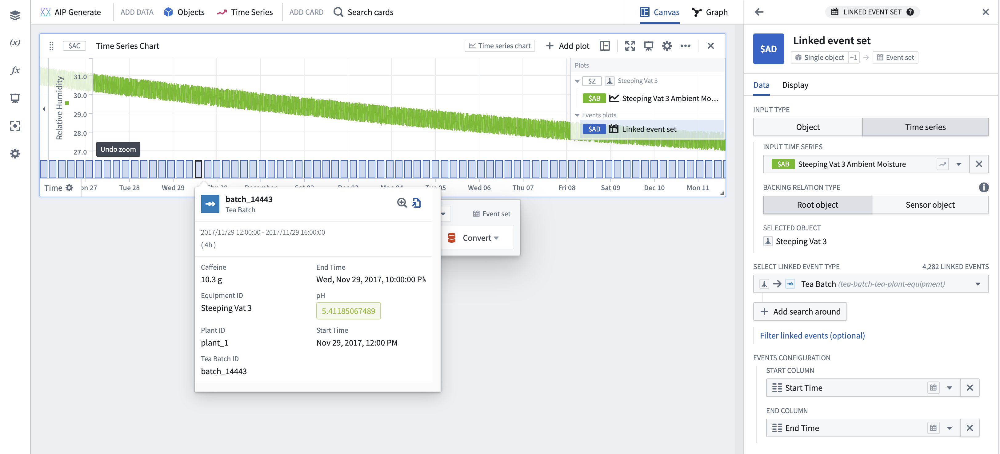

<!-- source: https://palantir.com/docs/foundry/quiver/card-linked-event-set/ · mirrored 2026-08-18 from Palantir Foundry docs -->

# Linked event set

Create an event set by starting from a base object and finding related objects through Ontology-defined links (also referred to as a [search around](/docs/foundry/quiver/objects-import-linked/)). Multiple layers of object relations can be traversed to build an event set of the desired type, and then the event set can optionally be filtered. Set the start and end timestamps for the events by specifying which object properties hold this data in the **Events configuration** settings in the **Data** tab of the editor panel. A linked event set can also be created from a starting time series. In this case, the [root object](/docs/foundry/time-series/time-series-concepts-glossary/#sensor-object-type) of the time series will be used as the base object. Linked event sets are object-based, so the event tooltips are populated using data from each object.

## Input type

Object or time series

## Output type

Event set

## Examples

## Usage information

| Functionality | Availability |
| --- | --- |
| [Standard Quiver card](/docs/foundry/quiver/core-concepts/#cards) | Supported |
| [Transform table transform](/docs/foundry/quiver/cards-transform-table/) | Unsupported |
