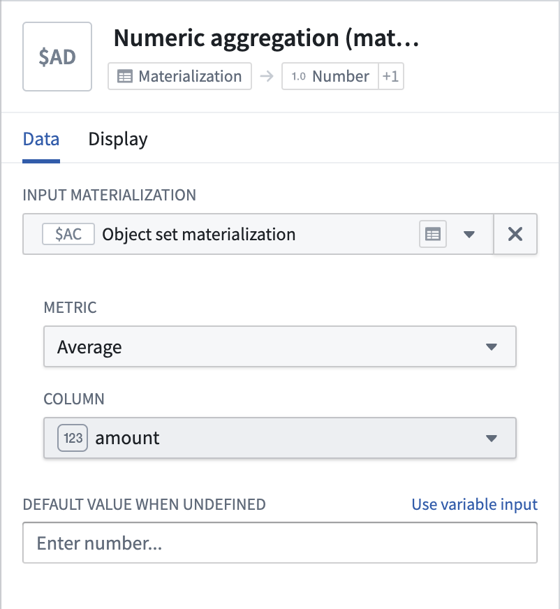

<!-- source: https://palantir.com/docs/foundry/quiver/card-numeric-aggregation-materialization/ · mirrored 2026-09-04 from Palantir Foundry docs -->

# Numeric aggregation (dataset)

Compute an aggregation on a numerical dataset column. Select an object set as input, choose the appropriate metric and property from available columns.

## Input type

Dataset

## Output type

Number, Time

## Usage information

| Functionality | Availability |
| --- | --- |
| [Standard Quiver card](/docs/foundry/quiver/core-concepts/#cards) | Supported |
| [Transform table transform](/docs/foundry/quiver/cards-transform-table/) | Unsupported |
