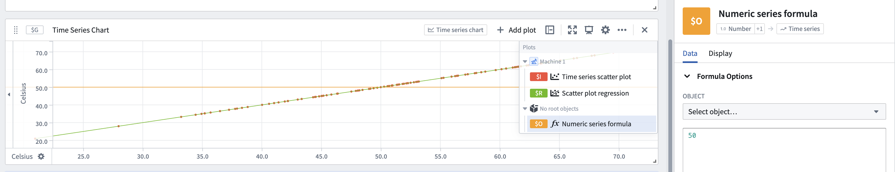

<!-- source: https://palantir.com/docs/foundry/quiver/card-numeric-series-formula/ · mirrored 2026-08-18 from Palantir Foundry docs -->

# Numeric series formula

Generates a numeric series plot by writing a formula in the formula box. Note that the x-axis will be numeric. This card works well on scatter plots or distributions. It should not be used on time series charts.

## Input type

Number or object

## Output type

Time series

## Examples

## Usage information

| Functionality | Availability |
| --- | --- |
| [Standard Quiver card](/docs/foundry/quiver/core-concepts/#cards) | Supported |
| [Transform table transform](/docs/foundry/quiver/cards-transform-table/) | Unsupported |

## See also

[Time series formula](/docs/foundry/quiver/card-time-series-formula/)
