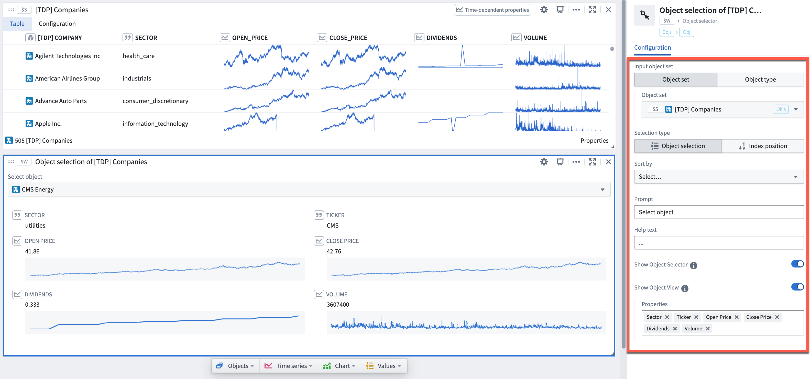

<!-- source: https://palantir.com/docs/foundry/quiver/card-object-selector/ · mirrored 2026-08-18 from Palantir Foundry docs -->

# Object selector

Provides a dropdown widget for selecting a single object from an input object set or object type. Useful for building interactive dashboards. To guide the user how to select a specific object, configure a **Prompt** and **Help text**. To show a view of the selected object, turn on **Show object view** or add an **Object view** card from the **Next actions** menu.

When popping out a single object row from an object set card, an object selector is automatically added to the analysis.

## Input type

None, Object set

## Output type

Single object

## Examples

## Usage information

| Functionality | Availability |
| --- | --- |
| [Standard Quiver card](/docs/foundry/quiver/core-concepts/#cards) | Supported |
| [Transform table transform](/docs/foundry/quiver/cards-transform-table/) | Unsupported |
