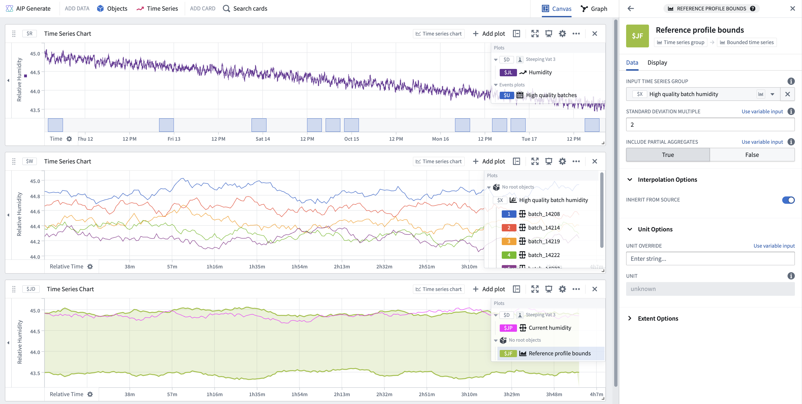

<!-- source: https://palantir.com/docs/foundry/quiver/card-reference-profile-bounds/ · mirrored 2026-08-22 from Palantir Foundry docs -->

# Reference profile bounds

Create a bounded region representing the variability among multiple time series, which is useful for monitoring other time series against these bounds. The bounds at each timestamp are computed by performing the following steps:

1. Aggregate the points at that time stamp to calculate the average and standard deviation.
2. Generate the upper bound by summing the average and standard deviation.
3. Generate the lower bound by subtracting the standard deviation from the average.

Use relative time series to ensure that there is overlapping data to be aggregated. Relative time series groups can be created using the [event comparison plot](/docs/foundry/quiver/card-event-comparison-plot/), or by using the [relative time series transform](/docs/foundry/quiver/card-relative-time-series/) on an existing time series group. The example below shows how reference profile bounds can be created from the humidity data of high-quality tea batches and used to monitor humidity for other batches.

## Input type

Time series group

## Output type

Bounded time series

## Examples

## Usage information

| Functionality | Availability |
| --- | --- |
| [Standard Quiver card](/docs/foundry/quiver/core-concepts/#cards) | Supported |
| [Transform table transform](/docs/foundry/quiver/cards-transform-table/) | Unsupported |

## See also

* You can use the [linear aggregation](/docs/foundry/quiver/card-linear-aggregation/) card to compute the average or standard deviation of multiple series if you would prefer a single representative series to a boundary region.
* If your input series are not in relative time, you most likely want [Bollinger bands](/docs/foundry/quiver/card-bollinger-bands/) instead of reference profile bounds.
