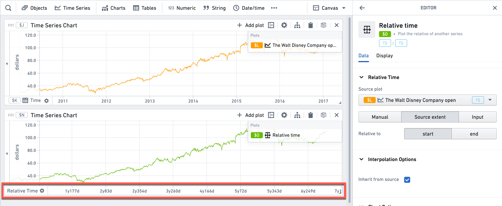

<!-- source: https://palantir.com/docs/foundry/quiver/card-relative-time-series/ · mirrored 2026-08-22 from Palantir Foundry docs -->

# Relative time

The relative axis plot type can be used to plot series against a time-axis that is not absolute. Instead, you can plot relative to the source plot used.

* In the example below, the relative axis is aligned to the start time of the series. Therefore, the X axis displays days/years since the first time point, instead of the absolute time.
* In addition to aligning to the source plot, you can also align to arbitrary [time ranges](/docs/foundry/quiver/timeseries-ranges/), time series searches, or arbitrary custom dates.

Learn more about [how to use relative time](/docs/foundry/quiver/timeseries-relative-time/).

:::callout{theme="warning" title="Sunset"}
The relative time card is in the [sunset phase of development](/docs/foundry/platform-overview/development-life-cycle/) and is no longer being updated. We recommend using the [**Relative time options**](/docs/foundry/quiver/timeseries-relative-time/#relative-time-toggle) section in the data configuration panel for time series plots instead.
:::

## Input type

Time series

## Output type

Time series

## Examples

## Usage information

| Functionality | Availability |
| --- | --- |
| [Standard Quiver card](/docs/foundry/quiver/core-concepts/#cards) | Supported |
| [Transform table transform](/docs/foundry/quiver/cards-transform-table/) | Supported |

## See also

[Event comparison plot](/docs/foundry/quiver/card-event-comparison-plot/)
