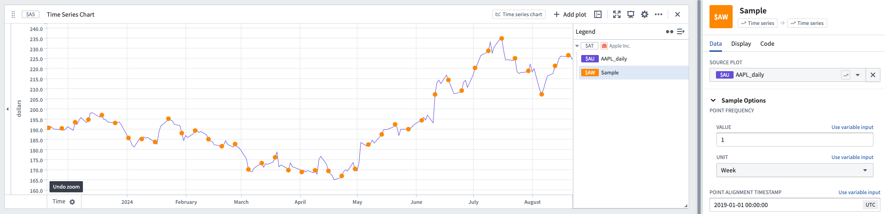

<!-- source: https://palantir.com/docs/foundry/quiver/card-sample/ · mirrored 2026-08-22 from Palantir Foundry docs -->

# Sample

Sample is used to resample an existing series at a constant frequency. This can be used in two primary scenarios:

* Data is coming in at a constant rate (such as daily), but some days no data was recorded. Rather than having gaps in the data, you can use Sample to resample at a daily rate to produce a complete series.
* Data is coming in at a constant rate (such as daily), but you would like a series that has data at a different rate (such as hourly or weekly).

Sample calculates its new points by using [interpolation](/docs/foundry/quiver/cards-interpolation-usage/#sample) between the existing data.

## Input type

Time series

## Output type

Time series

### Example

## Usage information

| Functionality | Availability |
| --- | --- |
| [Standard Quiver card](/docs/foundry/quiver/core-concepts/#cards) | Supported |
| [Transform table transform](/docs/foundry/quiver/cards-transform-table/) | Supported |
