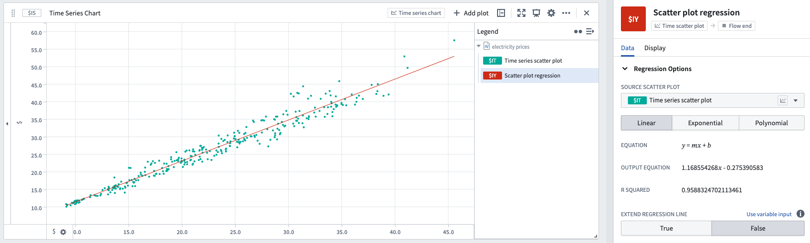

<!-- source: https://palantir.com/docs/foundry/quiver/card-scatter-plot-regression/ · mirrored 2026-08-18 from Palantir Foundry docs -->

# Scatter plot regression

Scatter plot regression is used to view the best-fit regression line over a time series scatter plot.

* Linear, polynomial (of degree 0-13), or exponential regression fits can be chosen.
* The time range used to compute the best fit line is set by default to be the source plot zoom range, but can be modified to match a [range](/docs/foundry/quiver/timeseries-ranges/) instead.

## Input type

Time series scatter plot

## Output type

Time series

## Examples

## Usage information

| Functionality | Availability |
| --- | --- |
| [Standard Quiver card](/docs/foundry/quiver/core-concepts/#cards) | Supported |
| [Transform table transform](/docs/foundry/quiver/cards-transform-table/) | Supported |

## See also

* [Time series scatter plot](/docs/foundry/quiver/card-time-series-scatter-plot/)
* [Scatter plot regression coefficients](/docs/foundry/quiver/card-scatter-plot-regression-coefficients/)
