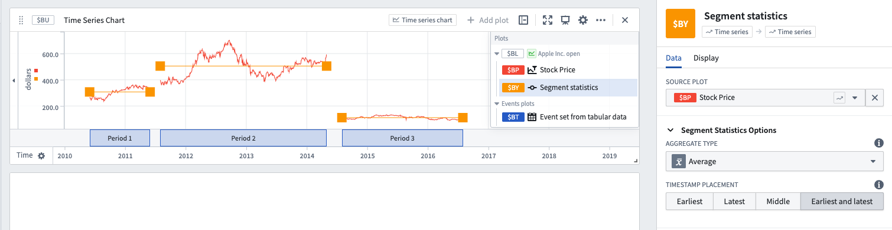

<!-- source: https://palantir.com/docs/foundry/quiver/card-segment-statistics/ · mirrored 2026-08-18 from Palantir Foundry docs -->

# Segment statistics

Segment statistics operate on the output of a [filtered](/docs/foundry/quiver/card-filter-time-series/) series.

* Filtered series will often be shown as discrete segments, with gaps in between each segment. The Segment statistics allows you to calculate statistics about each segment (such as average, max, or standard deviation).

:::callout{theme="warning" title="Sunset"}
The segment statistics card is in the [sunset phase of development](/docs/foundry/platform-overview/development-life-cycle/) and is no longer being updated. We recommend using the [event statistics card](/docs/foundry/quiver/card-event-statistics/) instead.
:::

## Input type

Time series

## Output type

Time series

## Examples

## Usage information

| Functionality | Availability |
| --- | --- |
| [Standard Quiver card](/docs/foundry/quiver/core-concepts/#cards) | Supported |
| [Transform table transform](/docs/foundry/quiver/cards-transform-table/) | Supported |
