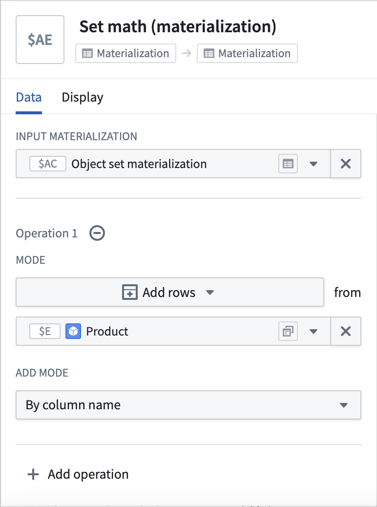

<!-- source: https://palantir.com/docs/foundry/quiver/card-set-math-materialization/ · mirrored 2026-08-18 from Palantir Foundry docs -->

# Set math (materialization)

Perform a union, intersection, or difference of two materializations.

## Input type

Materialization

## Output type

Materialization

## Usage information

| Functionality | Availability |
| --- | --- |
| [Standard Quiver card](/docs/foundry/quiver/core-concepts/#cards) | Supported |
| [Transform table transform](/docs/foundry/quiver/cards-transform-table/) | Unsupported |
