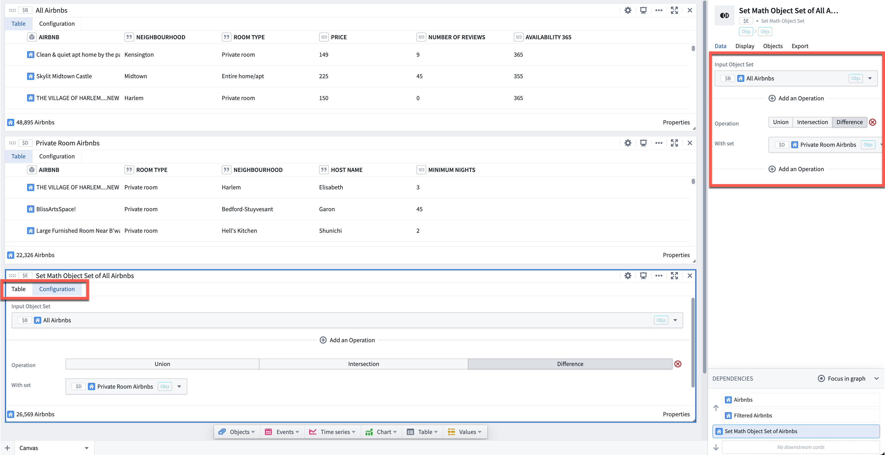

<!-- source: https://palantir.com/docs/foundry/quiver/card-set-math/ · mirrored 2026-08-18 from Palantir Foundry docs -->

# Set math

Takes as input two (or more) object sets *of the same type* and returns a combined object set based on operations defined by the user. Supported operations are the union, intersection, or difference of two object sets.

## Input type

Object set

## Output type

Object set

## Examples

In the example below, we are using set math to find the difference between a set of 48,895 Airbnb objects (`$B`) and a filtered set of 22,326 Airbnb objects (`$D`). The output is the set (`$E`) of 26,569 Airbnb objects in `$B` but not in `$D`.

Airbnb data used in this example is open source.

## Usage information

| Functionality | Availability |
| --- | --- |
| [Standard Quiver card](/docs/foundry/quiver/core-concepts/#cards) | Supported |
| [Transform table transform](/docs/foundry/quiver/cards-transform-table/) | Unsupported |

## Troubleshooting

### A Set math card does not recognize another object set

If an object set in your analysis is not available to select in a Set math card, confirm that its object type matches the card's other input. Set math operates only on object sets of the same type, so object sets of a different type are not listed as selectable inputs. This is the most common reason a Set math card appears to not recognize an object set that is otherwise present in your analysis.

To combine objects that are currently of different types, first bring them to a common type before applying set math. For example, use a [Switch to linked object set](/docs/foundry/quiver/card-switch-to-linked-object-set/) card to traverse a link from one object type to the other. You can then apply set math to the resulting object sets.

Alternatively, convert the object sets to [Datasets](/docs/foundry/quiver/card-object-set-materialization/) and use the [Set math (dataset)](/docs/foundry/quiver/card-set-math-materialization/) card, or convert the cards to [Transform tables](cards-transform-table.md#input-object-sets) and use the [Union (transform table)](/docs/foundry/quiver/card-union-transform-table/) card. Datasets and Transform tables allow for more flexible analytical operations.
