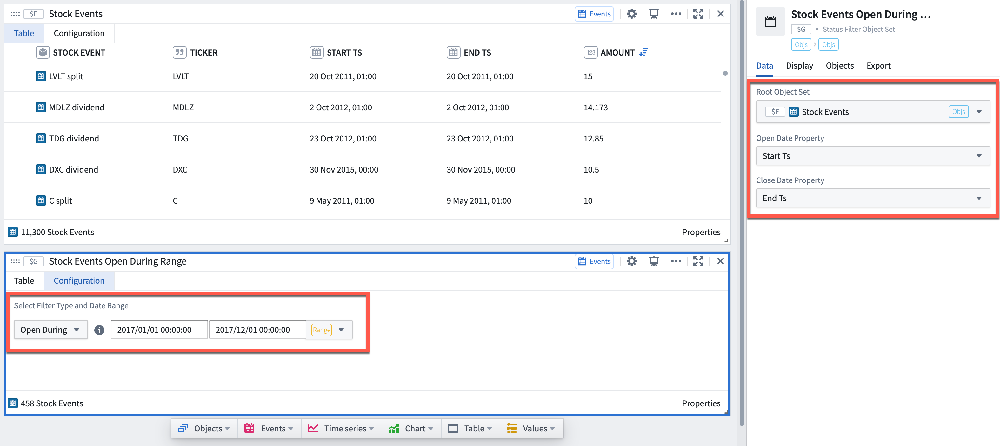

<!-- source: https://palantir.com/docs/foundry/quiver/card-status-filter/ · mirrored 2026-08-18 from Palantir Foundry docs -->

# Status filter

A specific type of object set filter that takes as input object sets which have start date/time and end date/time properties as well as a time range. The status filter returns a filtered set of events that were open or closed during a given date range. This object set is useful when you do not want to define logic based on when the start date or event date occurred, but would rather have the start and end dates define a period for a certain status (such as being open or closed over a certain time period).

* Objects **open** during the specified date range include:
  * Objects opened **before** the date range and closed**after** the date range.
  * Objects opened **during** the date range and closed**after** the date range.
* Objects **closed** during the specified date range include:
  * Objects opened **before** the date range and closed**during** the date range.
  * Objects opened **during** the date range and closed**during** the date range.
  * This does not include objects closed **before** thestart of the date range.

## Input type

Object set, time range

## Output type

Object set

## Examples

In the example below, we used the status filter toreturn the set of stock events that were open during the year 2017.

## Usage information

| Functionality | Availability |
| --- | --- |
| [Standard Quiver card](/docs/foundry/quiver/core-concepts/#cards) | Supported |
| [Transform table transform](/docs/foundry/quiver/cards-transform-table/) | Unsupported |
