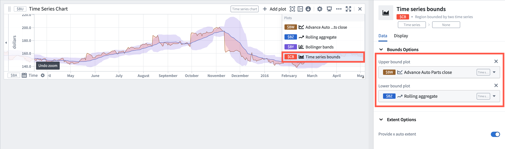

<!-- source: https://palantir.com/docs/foundry/quiver/card-time-series-bounds/ · mirrored 2026-08-22 from Palantir Foundry docs -->

# Time series bounds

The time series bound plots the region bounded by two time series.

## Input type

Time series

## Output type

Bounded time series

## Usage information

| Functionality | Availability |
| --- | --- |
| [Standard Quiver card](/docs/foundry/quiver/core-concepts/#cards) | Supported |
| [Transform table transform](/docs/foundry/quiver/cards-transform-table/) | Unsupported |

## See also

* [Extract time series bound](/docs/foundry/quiver/card-extract-time-series-bound/)
* [Bollinger bands](/docs/foundry/quiver/card-bollinger-bands/)
* [Reference profile bounds](/docs/foundry/quiver/card-reference-profile-bounds/)
